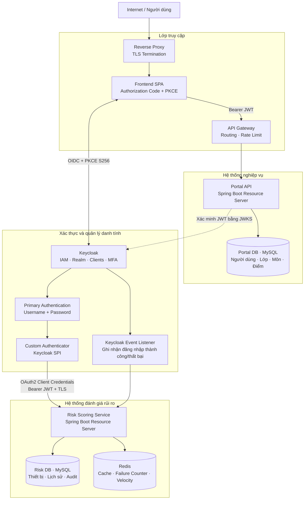
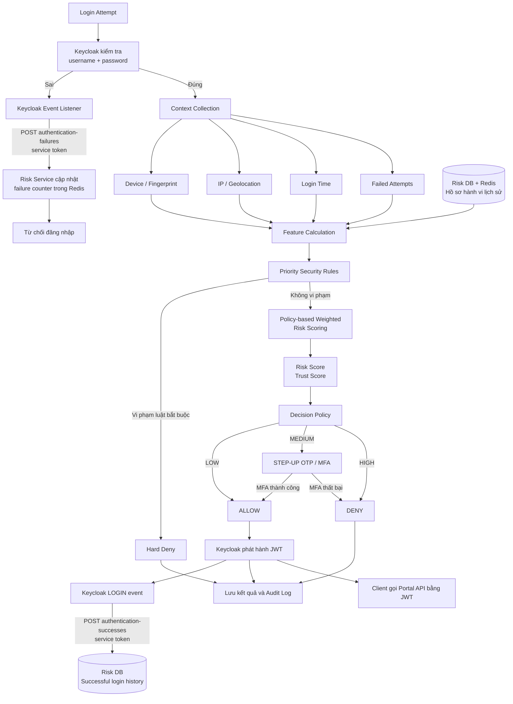

# Kiến trúc chuẩn của đồ án Zero Trust

**Trạng thái:** Đã chấp nhận (Accepted)  
**Ngày cập nhật:** 2026-09-18

**Phạm vi:** Kiến trúc đích và nguyên tắc triển khai bắt buộc của toàn bộ đồ án

## 1. Phạm vi đã chốt

Đồ án sử dụng kiến trúc **Zero Trust Adaptive Authentication** với một **Risk Scoring Service** độc lập. Risk Scoring Service đánh giá rủi ro đăng nhập dựa trên ngữ cảnh hiện tại, lịch sử xác thực và các chính sách bảo mật.

Các thành phần, ranh giới dịch vụ, luồng xác thực và ba loại quyết định `ALLOW`, `STEP_UP_MFA`, `DENY` trong tài liệu này đã được chốt.

Mô hình tính điểm chi tiết, trọng số của từng nhóm đặc trưng và ngưỡng số giữa các mức `LOW`, `MEDIUM`, `HIGH` **chưa được chốt**.

Kết quả đối chiếu với NIST, OWASP, OAuth BCP và tài liệu Keycloak được ghi tại
`SECURITY_REFERENCE_REVIEW.md`.

## 2. Sơ đồ kiến trúc hệ thống

## 3. Luồng xác thực và đánh giá rủi ro

## 4. Những nội dung đã chốt trong Risk Scoring

Pipeline đánh giá rủi ro gồm:

1. Thu thập ngữ cảnh đăng nhập hiện tại.
2. Đọc hồ sơ hành vi và lịch sử xác thực từ Risk DB và Redis.
3. Tính các đặc trưng rủi ro.
4. Kiểm tra Priority Security Rules.
5. Nếu không bị Hard Deny, thực hiện Policy-based Weighted Risk Scoring.
6. Phân loại kết quả thành `LOW`, `MEDIUM` hoặc `HIGH`.
7. Ánh xạ mức rủi ro sang `ALLOW`, `STEP_UP_MFA` hoặc `DENY`.
8. Lưu kết quả và Audit Log.

Các nhóm đặc trưng cấp cao đã xác định:

- Device Risk.
- Network / Location Risk.
- Temporal Risk.
- Authentication History Risk.

Priority Security Rules chạy trước weighted scoring. Một vi phạm bắt buộc có thể dẫn đến `Hard Deny` mà không phụ thuộc vào điểm tổng hợp.

Nguồn Network Risk của milestone hiện tại là policy CIDR IPv4/IPv6 do operator
quản lý, chạy nội bộ trong Risk Service và không gửi IP cho bên thứ ba. Provider
mặc định tắt; chỉ được bật khi reverse proxy/Keycloak đã cung cấp canonical client
IP và policy cho shared NAT/VPN đã được duyệt. CIDR network chỉ là một tín hiệu,
không thay thế identity hoặc device trust. External reputation/geolocation là một
thay đổi provider riêng và cần review SLA, privacy, retention cùng data residency.

## 5. Những nội dung chưa chốt

Các nội dung sau vẫn là quyết định thiết kế mở:

- Công thức tính điểm chi tiết.
- Cách chuẩn hóa từng đặc trưng.
- Trọng số của từng đặc trưng hoặc nhóm đặc trưng.
- Thang điểm chính thức của Risk Score và Trust Score.
- Ngưỡng số phân chia `LOW`, `MEDIUM`, `HIGH`.
- Danh sách đầy đủ và tham số của Priority Security Rules.
- Cách hiệu chỉnh trọng số và ngưỡng bằng dữ liệu thực nghiệm.

Không được tự sử dụng các trọng số `30% / 25% / 15% / 30%` hoặc các ngưỡng `0–29 / 30–69 / 70–100` làm giá trị chính thức. Đây chỉ là ví dụ từng được đề xuất và hiện không thuộc kiến trúc đã chốt.

Cho đến khi chủ đồ án phê duyệt, code không được hard-code trọng số hoặc ngưỡng giả định. Nếu cần tạo cấu trúc kỹ thuật trước, các giá trị phải nằm trong cấu hình và được đánh dấu `TBD`.

## 6. Phân chia trách nhiệm

### Reverse Proxy

- Là điểm vào từ Internet.
- TLS termination.
- Chuyển traffic đến API Gateway hoặc Keycloak.

### Frontend SPA

- Là public OIDC client, không có client secret.
- Dùng Authorization Code Flow với PKCE S256 trực tiếp với Keycloak.
- Chỉ giữ token trong memory của tab và gọi Portal API bằng Bearer access token.
- Không tự xử lý password/MFA và không quyết định quyền truy cập cuối cùng.
- Luồng triển khai chi tiết được quy định trong `LOGIN_FLOW.md`.

### API Gateway

- Routing đến Portal API.
- Rate limiting và chính sách bảo vệ tại biên.

### Keycloak

- Quản lý tài khoản, mật khẩu, realm role, clients và MFA.
- Thực hiện primary authentication.
- Phát hành JWT sau khi authentication flow thành công.

### Custom Authenticator

- Là Keycloak SPI trong authentication flow.
- Thu thập context đăng nhập.
- Gọi Risk Scoring Service.
- Dùng confidential service client `zerotrust-risk-caller` để lấy access token
  bằng Client Credentials; không dùng danh tính của người dùng đang đăng nhập.
- Chuyển quyết định thành allow, step-up MFA hoặc deny.
- Sau một `STEP_UP_MFA` thật và OTP thành công, đăng ký trusted device bằng role
  `risk:device:write`; chỉ phát cookie định danh thiết bị khi Risk API trả `204`.
- Cookie device là ID ngẫu nhiên realm-scoped, `HttpOnly`, `SameSite=Lax`, không
  phải credential và không thay password/MFA.
- Không tự chứa công thức, trọng số hoặc ngưỡng chấm điểm.

### Keycloak Event Listener

- Provider `zerotrust-risk-events` ghi nhận `LOGIN`, `invalid_user_credentials`
  và `user_not_found` của client được cấu hình, mặc định là `zerotrust-spa`;
  `expired_code`, lỗi do lockout, sự kiện Admin Console và client khác bị bỏ qua.
- Gửi sự kiện tới endpoint nội bộ của Risk Service bằng service token có role
  `risk:events:write`; không kết nối trực tiếp từ Keycloak tới Redis.
- Dùng lại URL, client credential và timeout của execution `ZeroTrust Risk
  Evaluation` trong Browser Flow, tránh lưu thêm một bản client secret.
- `LOGIN_ERROR` cập nhật counter ngắn hạn trong Redis; `LOGIN` lưu thời điểm xác
  thực dài hạn trong Risk DB để làm dữ liệu nguồn cho Temporal Profile.
- Lỗi telemetry chỉ được log ở mức an toàn và không thay đổi kết quả xác thực mà
  Keycloak đã quyết định.

### Risk Scoring Service

- Là Spring Boot service tách biệt với Portal.
- Trích xuất đặc trưng rủi ro.
- Áp dụng Priority Security Rules.
- Thực hiện Policy-based Weighted Risk Scoring sau khi mô hình được phê duyệt.
- Dựng Temporal Profile theo subject/client từ lịch sử đăng nhập thành công,
  baseline thứ trong tuần và giờ địa phương; cold-start hoặc lỗi dữ liệu không
  được hiểu là rủi ro thấp.
- Dải authentication-history high là guardrail bắt buộc MFA, không phụ thuộc việc
  factor này chỉ chiếm một phần trong weighted score; Keycloak vẫn sở hữu khóa
  brute-force tạm thời.
- Trả về mức rủi ro, quyết định và lý do.
- Chỉ nhận evaluation request có JWT đúng issuer, audience
  `zerotrust-risk-api`, authorized party `zerotrust-risk-caller` và client role
  `risk:evaluate`.
- Chỉ nhận request đăng ký trusted device từ cùng service caller khi token có
  client role riêng `risk:device:write`.
- Chỉ nhận authentication failure/success event khi token có client role riêng
  `risk:events:write`. Role đã được gán cho service account và dedicated scope của
  `zerotrust-risk-caller`; token runtime đã được xác minh có role này.
- Chỉ expose endpoint nội bộ qua TLS và mạng riêng trong production.

### Redis

- Lưu failure counter theo subject/IP trong cửa sổ thời gian 15 phút mặc định.
- Dùng HMAC cho phần định danh trong key, TTL cho mọi counter và event marker,
  cùng Lua script nguyên tử để chống một `eventId` làm tăng counter nhiều lần.
- Event Listener đã cấp dữ liệu thật cho các counter này; feature extractor đọc
  counter theo subject và source IP, ánh xạ theo các dải cấu hình rồi lấy mức cao
  hơn để tránh tính hai lần cùng một failure event.
- Lưu login velocity, rate limit và dữ liệu ngắn hạn.
- Cache dữ liệu thiết bị, IP hoặc hồ sơ cần truy cập nhanh.

### Risk DB

- Lưu thiết bị và hồ sơ hành vi rủi ro.
- Lưu mỗi `LOGIN` thành công theo `event_id`, subject, client, thời điểm Keycloak
  xác thực và thời điểm Risk Service ghi nhận; unique event ID chống ghi lặp.
- Có index `(subject_id, client_id, authenticated_at)` để đọc cửa sổ lịch sử cho
  Temporal Profile mà không quét toàn bảng.
- Lưu authentication event, kết quả đánh giá, quyết định và lý do.
- Lưu audit dài hạn.

### Portal API

- Xử lý nghiệp vụ người dùng, sinh viên, lớp, môn học và điểm.
- Là OAuth2 Resource Server stateless.
- Xác minh JWT của Keycloak bằng JWKS.
- Kiểm tra realm role và quyền trên từng tài nguyên.
- Không kiểm tra mật khẩu và không tự chấm điểm rủi ro đăng nhập.
- Không giữ phiên người dùng, refresh token hoặc OAuth authorized client.

### Portal DB

- Chỉ lưu hồ sơ người dùng và dữ liệu nghiệp vụ quản lý điểm.
- Không lưu mật khẩu.
- Tách biệt khỏi Risk DB.

## 7. Kiểm soát quyền trong Portal

JWT hợp lệ chỉ xác nhận danh tính. Portal vẫn phải kiểm tra:

- `STUDENT` chỉ được xem điểm của chính mình.
- `ADMIN` được quản lý người dùng, môn học và điểm của toàn hệ thống theo policy.
- Việc nhập và sửa điểm chỉ do `ADMIN` thực hiện; hệ thống không quản lý tài khoản giảng viên hoặc lớp học phần.

Portal xác minh chữ ký, issuer, expiration và audience của JWT bằng JWKS. Portal không gọi Keycloak để introspect mỗi API request.

## 8. Các ràng buộc không được tự ý thay đổi

- Không gộp Risk Scoring Service vào Portal.
- Không đặt logic chấm điểm trong controller hoặc Keycloak SPI.
- Không gộp Portal DB và Risk DB thành một miền dữ liệu.
- Không lưu mật khẩu tại Portal DB.
- Không lưu access token hoặc refresh token vào browser storage lâu dài.
- Không thêm client secret vào SPA hoặc biến môi trường `NEXT_PUBLIC_*`.
- Không dùng `zerotrust-provisioner`, user token hoặc client secret của SPA để gọi
  Risk API.
- Không chuyển Portal API về xác thực cookie/session nếu chưa cập nhật `LOGIN_FLOW.md` và mô hình CSRF.
- Không để Risk Scoring Service đọc trực tiếp dữ liệu nghiệp vụ Portal DB.
- Không bỏ qua Reverse Proxy, API Gateway, Keycloak hoặc bước xác minh JWT/JWKS trong kiến trúc đích.
- Không tự chọn trọng số, ngưỡng hoặc công thức chấm điểm khi chưa được phê duyệt.
- Không thay mô hình policy-based weighted scoring bằng ML hoặc mô hình khác khi chưa có chấp thuận rõ ràng.
- Không thay đổi ranh giới dịch vụ hoặc luồng xác thực nếu chưa cập nhật tài liệu này và được chủ đồ án chấp thuận.

Chi tiết triển khai và vận hành kết nối này nằm trong `RISK_API_SECURITY.md`.

## 9. Quy tắc thay đổi kiến trúc

Mọi đề xuất thay đổi phải:

1. Nêu rõ vấn đề của kiến trúc hiện tại.
2. Phân tích tác động và phương án thay thế.
3. Được chủ đồ án chấp thuận rõ ràng.
4. Cập nhật tài liệu này trước hoặc cùng lúc với code.

Nếu không có chấp thuận, kiến trúc trong tài liệu này là nguồn sự thật duy nhất để thiết kế, hướng dẫn và triển khai đồ án.
