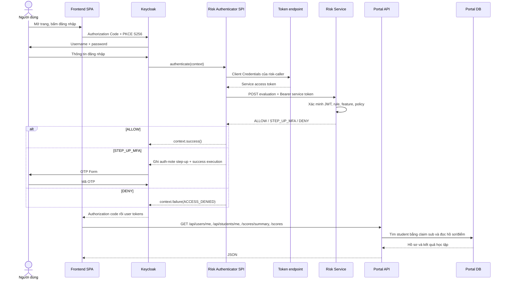
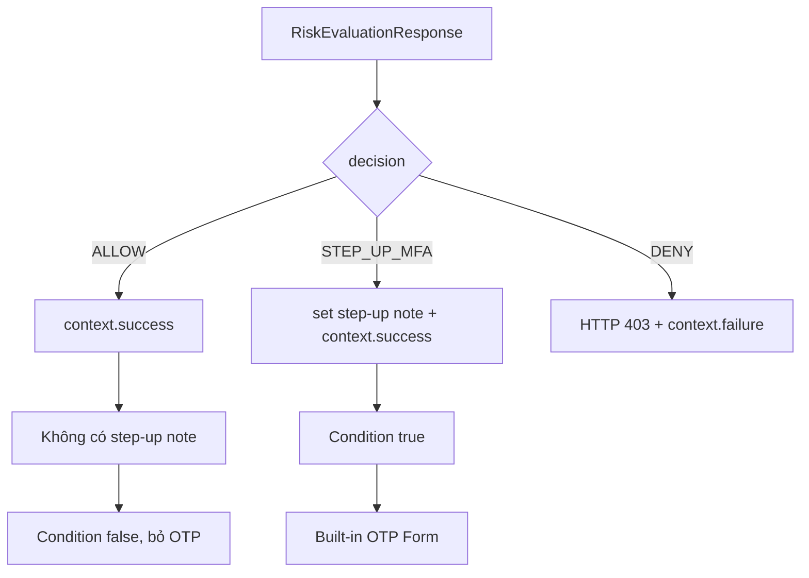

# Hướng dẫn đọc luồng code đăng nhập, Risk và xem điểm

**Ngày đối chiếu code:** 2026-09-11  
**Phạm vi:** Luồng runtime từ frontend sang Keycloak, Custom Authenticator SPI,
Risk Scoring Service, OTP và Portal API. Tài liệu liệt kê mọi type production
viết tay trực tiếp tham gia luồng này; test và CRUD quản trị không nằm trên đường
đăng nhập chỉ được nhắc ở phần ranh giới.

## 1. Bức tranh ngắn gọn nhất

Hệ thống có hai giai đoạn tách biệt:

```text
GIAI ĐOẠN 1 - XÁC THỰC, CHƯA CÓ USER TOKEN
Browser -> Frontend -> Keycloak -> password -> Risk SPI -> Risk API
                                             -> ALLOW / OTP / DENY
                                             -> Keycloak phát JWT nếu thành công

GIAI ĐOẠN 2 - DÙNG ỨNG DỤNG, ĐÃ CÓ USER TOKEN
Frontend -> Bearer user JWT -> Portal API -> Portal DB -> dữ liệu điểm
```

Risk Service chỉ chạy khi Keycloak đang xử lý một lần xác thực mới. Portal API
không gọi Risk Service mỗi lần xem điểm. Portal API chỉ kiểm tra JWT đã được
Keycloak phát hành.



Hai Bearer token trong sơ đồ là hai token khác nhau:

| Token | Danh tính | Dùng để làm gì |
|---|---|---|
| Service token | `zerotrust-risk-caller` | Extension gọi Risk API |
| User access token | user đang đăng nhập, client `zerotrust-spa` | Frontend gọi Portal API |

`zerotrust-risk-api` là resource/audience chứa role `risk:evaluate`.
`zerotrust-provisioner` là service account khác, chỉ dùng để Portal Backend quản
lý user qua Keycloak Admin API.

## 2. Các khái niệm cần hiểu trước khi đọc class

### SPI là gì?

SPI là **Service Provider Interface**: một điểm mở rộng mà Keycloak công bố.
Keycloak định nghĩa interface `Authenticator` và `AuthenticatorFactory`; dự án
cung cấp implementation. Khi JAR được đặt trong thư mục providers, Java
`ServiceLoader` đọc file
`META-INF/services/org.keycloak.authentication.AuthenticatorFactory` để tìm hai
factory của dự án.

Nói đơn giản, Keycloak là ổ cắm, SPI là chuẩn chân cắm, JAR của dự án là thiết bị
cắm vào ổ đó.

### Authentication Flow là gì?

Authentication Flow là danh sách các bước Keycloak phải chạy để xác thực một
request. Flow `zerotrust-browser` hiện được bind cho Browser Flow của realm
`DoAn`:

```text
Username Password Form                         REQUIRED
ZeroTrust Risk Evaluation                     REQUIRED
Risk step-up MFA                              CONDITIONAL
  Condition - ZeroTrust step-up required      REQUIRED
  OTP Form                                    REQUIRED
```

- `REQUIRED`: bước phải thành công, nếu thất bại thì cả flow thất bại.
- `CONDITIONAL`: subflow chỉ chạy khi condition bên trong trả `true`.
- `OTP Form` là authenticator có sẵn của Keycloak. Code của dự án không tự kiểm
  tra mã OTP.
- `context.success()` trong `RiskAuthenticator` chỉ nói rằng **execution Risk đã
  hoàn tất**. Nó chưa có nghĩa toàn bộ lần đăng nhập đã hoàn tất.

### Auth-note là gì?

Auth-note là dữ liệu tạm gắn với `AuthenticationSessionModel`, tức một lần login
hiện tại. `RiskAuthenticator` ghi note `step-up-required=true`; condition phía
sau đọc note đó để mở OTP. Note mất khi login session kết thúc. Nó không phải
user attribute, không phải bản ghi thiết bị và không phải “nhớ MFA”.

### Factory, DTO, domain, repository là gì?

- **Factory** tạo object cho framework và công bố metadata/cấu hình.
- **DTO** là phong bì JSON đi qua ranh giới HTTP.
- **Domain type** là cách service biểu diễn dữ liệu và kết quả ở bên trong.
- **Repository** là cửa truy cập database.
- **Properties class** biến cấu hình text thành object typed và kiểm tra tính hợp
  lệ ngay khi khởi động.

## 3. Luồng frontend trước khi vào Keycloak

### `frontend/lib/keycloak.ts`

- `getKeycloak()` tạo singleton `Keycloak` trong browser từ URL, realm và public
  client `zerotrust-spa`. Public SPA không có client secret.
- `initializeKeycloak()` chỉ init một lần. `check-sso` thử xác định phiên SSO hiện
  có; `pkceMethod: "S256"` bật Authorization Code + PKCE; login iframe định kỳ bị
  tắt; silent callback dùng `silent-check-sso.html`.
- `appRedirectUri()` trả URL gốc của frontend để dùng sau login/logout.
- `silent-check-sso.html` gửi URL callback từ iframe về cửa sổ cha bằng
  `postMessage` cho `keycloak-js` xử lý.

### `frontend/app/page.tsx`

- `getTotal()` gọi một API phân trang với size nhỏ và lấy `totalElements`; chỉ
  phục vụ ba ô thống kê của admin.
- `currentIdentity()` đọc `preferred_username` và `realm_access.roles` từ token
  để chọn giao diện. Đây là điều khiển UI; backend vẫn kiểm tra quyền thật.
- Component `AdminDashboard()` hiện là component gốc điều phối cả ba trạng thái
  login, admin và student, dù tên class dễ làm người đọc tưởng nó chỉ dành cho
  admin.
- `bootstrap()` gọi `initializeKeycloak()`, gắn callback logout/refresh-error rồi
  phân nhánh:
  - chưa authenticated -> màn hình login;
  - có `STUDENT` nhưng không có `ADMIN` -> màn hình điểm;
  - có `ADMIN` -> dashboard admin;
  - không có hai role -> forbidden.
- `login()` gọi `keycloak.login({redirectUri})`. Browser đi thẳng sang Keycloak;
  Portal Backend không nhận password hay OTP.
- `logout()` gọi end-session của Keycloak. Nếu lời gọi thất bại, nhánh fallback
  chỉ xóa token cục bộ bằng `clearToken()`.
- Phần render chọn component theo `accessState`.

### `frontend/lib/api.ts`

- `AuthenticationExpiredError` là lỗi riêng để UI nhận biết phiên không thể tiếp
  tục.
- `refreshToken(force)` gọi `updateToken(30)` bình thường hoặc `updateToken(-1)`
  khi buộc refresh. `refreshInFlight` gộp các request đồng thời vào cùng một lần
  refresh. Lỗi refresh làm token trong memory bị xóa.
- `request()` thêm `Authorization: Bearer <user-access-token>` và đặt
  `credentials: "omit"`; Portal không dựa vào browser cookie.
- `apiFetch()` refresh trước request. Nếu API trả 401, nó buộc refresh và retry
  đúng một lần, không lặp vô hạn.

Token do `keycloak-js` giữ trong memory của tab, không được code ghi vào
`localStorage`, `sessionStorage` hay IndexedDB.

## 4. Extension chạy bên trong Keycloak

### 4.1. Nhóm SPI và flow

#### `RiskAuthenticatorFactory`

Đây là điểm Keycloak dùng để khám phá và tạo Custom Authenticator.

- `PROVIDER_ID` là `zerotrust-risk-authenticator`.
- `CONFIG_PROPERTIES` mô tả các ô trong Admin Console: Risk URL, token endpoint,
  caller client ID/secret, refresh skew, timeout, giới hạn response và failure
  mode.
- `create(KeycloakSession)` lấy HTTP client do Keycloak quản lý, dựng token
  provider, HTTP Risk client, extractor, config resolver, decision handler rồi
  trả `RiskAuthenticator`.
- `getId()`, `getDisplayType()`, `getReferenceCategory()`, `getHelpText()` trả
  metadata cho Admin Console.
- `isConfigurable()` trả `true`; mỗi execution có config riêng.
- `getRequirementChoices()` chỉ cho `REQUIRED` hoặc `DISABLED`.
- `isUserSetupAllowed()` trả `false`; authenticator không có thao tác setup riêng
  cho user.
- `getConfigProperties()` trả danh sách form config.
- `init()` và `postInit()` không cần khởi tạo global state.
- `close()` xóa token cache khi provider đóng.
- `property()`, `requiredProperty()`, `secretProperty()`, `listProperty()` là các
  helper dựng metadata; secret dùng kiểu password và được đánh dấu secret.

#### `RiskAuthenticator`

Đây là class điều phối chính sau khi username/password đã xác định được user.

- Constructor nhận `LoginContextExtractor`, `RiskAuthenticatorConfigResolver`,
  `RiskScoringClientFactory` và `RiskDecisionHandler`, đồng thời reject null.
- `authenticate(context)` thực hiện đúng thứ tự:
  1. mặc định failure mode là `DENY`;
  2. parse config của execution;
  3. tạo request từ ngữ cảnh Keycloak;
  4. tạo Risk client từ config;
  5. gọi Risk API;
  6. giao response cho `RiskDecisionHandler`.
- Catch `RiskScoringClientException` ghi loại lỗi/status và áp dụng failure mode
  đã cấu hình.
- Catch `RuntimeException` bao gồm lỗi config/context/bug và luôn deny.
- `action(context)` deny nếu bị gọi, vì authenticator này không có form/action
  riêng.
- `requiresUser()` trả `true`, nên đặt execution trước bước xác định user sẽ bị
  fail-closed.
- `configuredFor()` luôn trả `true`; nó không kiểm tra user đã có OTP credential.
- `setRequiredActions()` không làm gì; built-in OTP execution quản lý enrollment.
- `close()` không đóng HTTP client vì vòng đời client thuộc Keycloak.

#### `RiskStepUpConditionFactory`

- `getSingleton()` trả `RiskStepUpCondition.INSTANCE`.
- `getId()` là `zerotrust-risk-step-up-condition`.
- `getDisplayType()` và `getHelpText()` mô tả condition trong Admin Console.
- `isConfigurable()` và `isUserSetupAllowed()` trả `false`.
- `getRequirementChoices()` cung cấp requirement phù hợp cho condition.
- `getConfigProperties()` trả danh sách rỗng.
- `init()`, `postInit()`, `close()` không cần làm gì.

#### `RiskStepUpCondition`

- `matchCondition(context)` đọc note
  `zerotrust.risk.step-up-required`; chỉ chuỗi parse thành `true` mới mở subflow.
- `action()` không làm gì vì condition không hiển thị form.
- `requiresUser()` trả `true`.
- `setRequiredActions()` và `close()` không làm gì.

#### File đăng ký service

`META-INF/services/org.keycloak.authentication.AuthenticatorFactory` chứa tên
đầy đủ của `RiskAuthenticatorFactory` và `RiskStepUpConditionFactory`. Thiếu file
này thì JAR có class nhưng Keycloak không tìm thấy provider.

### 4.2. Nhóm thu thập login context

#### `LoginContextExtractor`

Interface có `extract(context)`. Nó tách orchestration khỏi API cụ thể của
Keycloak và giúp test bằng mock.

#### `KeycloakLoginContextExtractor`

- Constructor nhận `DeviceIdResolver`.
- `extract(context)` lấy user ID, root authentication-session ID, tab ID, client
  ID, remote IP, User-Agent và device ID. Session gửi sang Risk API là
  `rootSessionId:tabId` để phân biệt login attempt/tab.
- `require()` reject object bắt buộc bị null.
- `requireText()` reject chuỗi bắt buộc bị null/blank.
- `truncate()` giới hạn User-Agent ở 1024 ký tự.

Thiếu user/session/client/IP tạo runtime exception và cuối cùng bị deny.

#### `DeviceIdResolver` và `CookieDeviceIdResolver`

- `DeviceIdResolver.resolve(context)` là abstraction để sau này có thể đổi nguồn
  device ID.
- `CookieDeviceIdResolver.resolve()` đọc cookie `ZT_DEVICE_ID`; thiếu thì trả
  `null`.
- `validatedValue()` chỉ nhận độ dài 8-255 và ký tự `[A-Za-z0-9._~-]`; giá trị
  sai trở thành `null`.

Code này **chỉ đọc cookie**. Nó chưa phát cookie, chưa ký cookie và chưa ghi nhận
thiết bị sau OTP.

### 4.3. Nhóm cấu hình typed

#### `RiskAuthenticatorConfig`

Record gom `RiskScoringClientConfig`, `ServiceTokenConfig`, `RiskFailureMode` và
reject null trong compact constructor.

#### `RiskAuthenticatorConfigResolver`

- `resolve(model)` đọc map config của Keycloak, yêu cầu Risk URL/token URL/secret,
  áp default và tạo config typed.
- `uri()` parse URI.
- `text()` đọc text hoặc default.
- `duration()` đọc duration dương.
- `integer()` đọc integer dương.
- `nonNegativeDuration()` đọc refresh skew, cho phép 0.
- `parsePositiveInteger()` reject chuỗi sai, 0 và số âm.
- `failureMode()` chỉ nhận `DENY` hoặc `STEP_UP_MFA`.
- `requireText()` reject missing/blank.

Default hiện tại: caller `zerotrust-risk-caller`, refresh sớm 30 giây, pool wait
500 ms, connect 2 giây, socket 3 giây, response 64 KiB, failure mode `DENY`.

#### `RiskScoringClientConfig`

- Compact constructor chỉ nhận HTTP/HTTPS có host, không query/fragment/userinfo;
  timeout phải dương, response limit 1 byte đến 1 MiB.
- `defaults()` tạo bộ timeout/limit mặc định.
- `evaluationUri()` nối base URL với `/internal/v1/risk/evaluations`.
- `requirePositive()` kiểm tra duration.
- `timeoutMillis()` đổi `Duration` thành integer milliseconds an toàn.

#### `ServiceTokenConfig`

- Compact constructor kiểm tra token endpoint, client ID/secret và refresh skew.
- `toString()` thay secret bằng `***`.
- `requireText()` trim và reject chuỗi rỗng.

#### `RiskAuthenticatorConfigurationException`

Exception dành cho cấu hình sai; hai constructor hỗ trợ message hoặc
message+cause. Trong login flow nó rơi vào catch runtime và bị deny.

### 4.4. Nhóm lấy service token

#### `ServiceTokenProvider`

- `accessToken()` trả service token hiện tại hoặc tải token mới.
- `invalidate(rejectedToken)` chỉ định token vừa bị Risk API từ chối.

#### `ClientCredentialsTokenProvider`

- Constructor nhận Keycloak-managed HTTP client, token config và cache; dựng
  timeout, cache key và tắt redirect.
- `accessToken()` dùng cache nếu token còn nằm ngoài refresh window, nếu không gọi
  `requestToken()`.
- `invalidate()` yêu cầu cache xóa đúng token bị từ chối.
- `requestToken()` POST `grant_type=client_credentials` với Basic client
  authentication; chỉ nhận 2xx, JSON và body tối đa 16 KiB.
- `basicAuthorization()` form-encode ID/secret rồi Base64 cho header Basic.
- `formEncode()` URL-encode credential.
- `verifyJsonContentType()` chỉ nhận JSON hoặc media type hậu tố `+json`.
- `readBody()` đọc stream có giới hạn.
- `parseToken()` yêu cầu `access_token`, `token_type=Bearer`, `expires_in > 0` và
  tính thời điểm hết hạn.
- `requiredString()`, `positiveLong()`, `initialCapacity()` là helper parse/cấp
  phát.
- `tokenResponseTooLarge()` và `invalidTokenResponse()` chuẩn hóa exception.

#### `ServiceTokenCache`

- `getOrLoad()` có fast path rồi dùng `ConcurrentHashMap.compute()` để nhiều login
  đồng thời không xin nhiều token mới.
- `invalidate()` compare-and-remove; request cũ không xóa nhầm token mới.
- `clear()` xóa cache.
- `isUsable()` kiểm tra `now + refreshSkew < expiresAt`.
- Nested record `TokenCacheKey` gồm token endpoint + client ID.
- Nested record `CachedToken` gồm access token + expiry.

### 4.5. Nhóm HTTP Risk client

#### `RiskScoringClient`

Interface có `evaluate(request)` trả `RiskEvaluationResponse`.

#### `RiskScoringClientFactory`

Functional interface có `create(config)`. Authenticator chỉ tạo client sau khi đã
đọc config của execution; test có thể thay bằng fake client.

#### `HttpRiskScoringClient`

- Constructor nhận HTTP client, config và token provider; dựng evaluation URI,
  timeout, response limit và tắt redirect.
- `evaluate(request)` serialize request, lấy service token và gọi `execute()`. Nếu
  chính Risk API trả 401, nó invalidate token rồi lấy token mới và retry đúng một
  lần.
- `execute()` POST JSON với Bearer service token, yêu cầu 2xx/body JSON/đúng size,
  deserialize và kiểm tra correlation.
- `requireAccessToken()` reject token blank, whitespace hoặc control character.
- `serialize()` đổi request record thành JSON.
- `verifyJsonContentType()` kiểm tra response media type.
- `readResponseBody()` đọc body theo giới hạn cấu hình.
- `initialBufferCapacity()` giới hạn cấp phát ban đầu.
- `responseTooLarge()` tạo lỗi response quá lớn.
- `deserialize()` đổi JSON thành response record.
- `verifyCorrelation()` bắt response có cùng `subjectId` và
  `authenticationSessionId` với request.

401 từ token endpoint xảy ra trước lần gọi Risk API nên không thuộc nhánh retry
này.

#### `RiskScoringClientException`

- Các factory `serialization()`, `timeout()`, `interrupted()`, `connection()`,
  `httpStatus()`, `tokenEndpointStatus()`, `invalidResponse()` chuẩn hóa loại lỗi.
- `failureType()` và `statusCode()` cung cấp thông tin an toàn cho log/policy.
- Enum `FailureType` phân biệt serialization, connection, timeout, interrupted,
  HTTP và invalid response.

### 4.6. DTO của extension

#### `RiskEvaluationRequest`

Record chứa `subjectId`, `authenticationSessionId`, `clientId`, `ipAddress`,
`userAgent`, `deviceId`. Compact constructor và `requireText()` bắt buộc bốn
trường đầu; hai trường cuối được phép null.

#### `RiskEvaluationResponse`

Record chứa `evaluationId`, hai trường correlation, `riskScore`, `riskLevel`,
`decision`, `dataStatus`, `reasons`, `evaluatedAt`. Compact constructor bắt buộc
mọi trường trừ score và copy reasons thành immutable list.

Các enum `RiskDecision`, `RiskLevel`, `RiskDataStatus`, `RiskReason` là vocabulary
JSON phải khớp enum ở Risk Service. Hiện DTO bị lặp ở hai module; đổi contract một
phía có thể tạo `INVALID_RESPONSE`.

### 4.7. Nhóm áp quyết định vào flow

#### `RiskAuthenticationNotes`

- Các constant đặt tên note cho step-up, decision, evaluation ID, level, data
  status và failure type.
- Constructor private ngăn tạo object tiện ích.
- `clear(session)` xóa toàn bộ note cũ trước khi áp kết quả mới.

#### `RiskDecisionHandler`

- `handle(context, evaluation)` clear note, lưu metadata rồi switch đúng theo
  `evaluation.decision()`.
- `handleUnavailable(context, failureMode, failureType)` xử lý lúc không lấy được
  quyết định: `STEP_UP_MFA` thì đặt note và cho execution đi tiếp; `DENY` thì
  chặn.
- `requireStepUp(session)` đặt note `step-up-required=true`.
- `deny(context)` tạo error page HTTP 403 và gọi
  `context.failure(ACCESS_DENIED, ...)`.

Extension không tự suy diễn lại từ score hay level. Trường `decision` trong
response là trường duy nhất điều khiển nhánh flow.

#### `RiskFailureMode`

- `DENY`: fail-closed, cũng là default hiện tại.
- `STEP_UP_MFA`: khi Risk API lỗi vẫn yêu cầu OTP thay vì chặn hoàn toàn.

## 5. Risk Scoring Service

### 5.1. Khởi động và cổng bảo vệ

#### `RiskScoringApplication`

- `main()` gọi `SpringApplication.run()`.
- `@SpringBootApplication` bật component scan/auto-configuration.
- `@ConfigurationPropertiesScan` tìm các properties class.

#### `RiskApiSecurityProperties`

Record chứa issuer URI, JWKS URI, audience, allowed caller client ID và cờ
require HTTPS.

- `isEndpointConfigurationValid()` kiểm tra cả hai URI.
- `validEndpoint()` yêu cầu URI tuyệt đối có host, không userinfo/query/fragment;
  dùng HTTPS trừ khi profile dev tắt `requireHttps`.

#### `RiskApiSecurityConfig`

- `riskJwtDecoder()` dựng `NimbusJwtDecoder` từ JWKS; kiểm tra signature, issuer,
  thời gian, sự hiện diện của `exp` và audience `zerotrust-risk-api`.
- `riskSecurityFilterChain()` cấu hình stateless, tắt CSRF/CORS/request cache;
  chỉ public `GET /actuator/health`; POST evaluation cần đúng `azp` và authority
  `risk:evaluate`; mọi path/method khác bị từ chối.
- Anonymous `doFilterInternal()` trả 403 `HTTPS_REQUIRED` nếu production yêu cầu
  TLS mà request đến bằng HTTP.
- `writeError()` trả JSON lỗi thống nhất.

Phân biệt kết quả:

```text
JWT thiếu/sai signature/issuer/audience/thời gian -> HTTP 401
JWT hợp lệ nhưng sai azp hoặc thiếu đúng role      -> HTTP 403
Engine quyết định DENY                             -> HTTP 200 + decision=DENY
```

#### `RiskJwtAuthenticationConverter`

- Constructor nhận resource client ID.
- `convert(jwt)` chỉ đọc role dưới
  `resource_access.zerotrust-risk-api.roles`. Realm role hoặc role của client
  khác không cấp authority cho Risk API.

### 5.2. HTTP API, DTO và validation

#### `RiskEvaluationController`

- `evaluate(request)` nhận JSON đã `@Valid`, gọi
  `request.toDomain(Instant.now())`, gọi `RiskEvaluationService.evaluate()` rồi
  `RiskEvaluationResponse.from()`.
- Controller không tính điểm và không truy vấn DB trực tiếp.

#### `dto.request.RiskEvaluationRequest`

- Bean Validation bắt buộc subject/session/client/IP, giới hạn độ dài và xác minh
  IP.
- `toDomain(receivedAt)` tạo `LoginContext` dùng bên trong engine.

`clientId` trong body là `zerotrust-spa`, tức client người dùng đang login. Claim
`azp` của service token là `zerotrust-risk-caller`; hai khái niệm khác nhau.

#### `ValidIpAddress` và `IpAddressValidator`

- Annotation `ValidIpAddress` trỏ tới validator.
- `isValid()` để null/blank cho `@NotBlank` xử lý, sau đó chọn IPv4/IPv6.
- `isIpv4()` yêu cầu đúng bốn phần chữ số, mỗi phần 0-255.
- `isIpv6()` lọc ký tự rồi dùng `InetAddress`, đồng thời bắt kết quả là IPv6.

#### `GlobalExceptionHandler` và `ValidationErrorResponse`

- `handleValidation()` bắt `MethodArgumentNotValidException`, chọn lỗi đầu cho
  từng field và trả HTTP 400.
- `ValidationErrorResponse` mang timestamp/status/message/path/field-errors;
  compact constructor copy map thành immutable.

#### `dto.response.RiskEvaluationResponse`

- Record là JSON kết quả cuối cùng.
- `from(request, evaluation)` gắn lại `subjectId` và session ID ban đầu để
  extension kiểm tra correlation; không trả lại IP, User-Agent, device ID hay
  từng factor.

### 5.3. Điều phối rule và feature

#### `RiskEvaluationService`

- `evaluate(context)` chạy `PrioritySecurityRuleEvaluator.firstViolation()`
  trước. Có vi phạm thì deny ngay; không có mới gọi `evaluateFeatures()`.
- `evaluateFeatures()` gọi extractor, deny nếu extractor phát hiện priority
  violation như revoked device, step-up nếu data chưa complete, và chỉ weighted
  scoring khi data complete.

#### `PrioritySecurityRule`

Interface có `evaluate(context)` trả `Optional<RiskReason>`: empty là không vi
phạm, có reason là phải hard deny.

#### `PrioritySecurityRuleEvaluator`

- Constructor nhận toàn bộ bean rule từ Spring.
- `firstViolation()` chạy tuần tự và dừng ở vi phạm đầu tiên.

#### `BlockedIpPrioritySecurityRule`

- Constructor đọc cấu hình, trim, bỏ blank và tạo immutable exact-IP set.
- `evaluate()` trả `BLOCKED_IP_ADDRESS` khi IP khớp chính xác.

Hiện rule chưa hiểu CIDR/subnet hoặc IP reputation.

#### `RiskFeatureExtractor`

Interface có `extract(context)` trả `RiskFeatureExtraction`.

#### `DatabaseBackedRiskFeatureExtractor`

`extract()` hiện thực hiện:

1. gọi `DeviceRecognitionService.recognize()`;
2. map `MISSING/NEW/PENDING/TRUSTED/REVOKED` thành device score/reason;
3. revoked device tạo priority violation;
4. luôn thêm ba reason network, temporal và authentication history unavailable;
5. đặt ba factor đó bằng 0;
6. luôn trả `RiskDataStatus.INCOMPLETE`.

Ba số 0 không được dùng để tạo score thấp giả, vì orchestrator không gọi weighted
scoring khi data status là `INCOMPLETE`.

### 5.4. Nhận diện và lưu thiết bị

#### `DeviceRecognitionService`

- `recognize(context)` chạy read-only. Thiếu device ID -> `MISSING`; có ID ->
  HMAC rồi query theo subject+hash; không có row -> `NEW`; có row -> map status.
- `toRecognitionStatus()` đổi enum persistence sang enum domain.

Service này hiện **chỉ đọc**: không insert, không update last-seen, không trust.

#### `DeviceFingerprintHasher`

- Constructor biến pepper thành HMAC key.
- `hash(subjectId, deviceId)` trim, ghép bằng ký tự NUL, HMAC-SHA256 rồi trả 64
  hex lowercase.
- `requireText()` reject null/blank.

#### `KnownDeviceEntity`

- Constructor public tạo device `PENDING`, đặt first/last seen bằng thời điểm đầu.
- `markSeen()` chỉ đẩy last-seen tiến lên.
- `trust()` đặt `TRUSTED`, ghi trusted-at, xóa revoked-at và mark seen.
- `revoke()` đặt `REVOKED`, ghi revoked-at và mark seen.
- `requireText()` và `requireSha256Hex()` giữ invariant.
- Field `version` dùng optimistic locking.

Các method lifecycle đã có nhưng **không method production nào hiện gọi chúng**
trong login flow.

#### `KnownDeviceRepository`

- Kế thừa `JpaRepository`, được Spring sinh CRUD.
- `findBySubjectIdAndDeviceFingerprintHash()` đang được recognition service dùng.
- `existsBySubjectIdAndDeviceFingerprintHashAndStatus()` hiện chưa được runtime
  dùng.

#### `DeviceStatus`

Enum persistence: `PENDING`, `TRUSTED`, `REVOKED`. `MISSING` và `NEW` chỉ là kết
quả suy luận runtime, không phải trạng thái lưu DB.

Migration `V1__create_known_devices.sql` tạo bảng, unique
`(subject_id, device_fingerprint_hash)`, check status, index subject/status và
last-seen.

### 5.5. Tính điểm và quyết định

#### `RiskScoringService`

- `evaluate(factors)` gọi weighted score, phân loại level, map decision, tạo UUID
  và trả `COMPLETE`.
- `stepUpForIncompleteData(reasons)` trả score `null`, `MEDIUM`, `STEP_UP_MFA`,
  `INCOMPLETE`.
- `denyForPriorityRule(reason)` trả score `null`, `HIGH`, `DENY`,
  `NOT_EVALUATED`.
- `weightedScore()` tính:

```text
device * deviceWeight
+ network * networkWeight
+ temporal * temporalWeight
+ authenticationHistory * authenticationHistoryWeight
```

  Kết quả làm tròn hai chữ số theo `HALF_UP`.
- `classify()` dùng ngưỡng high trước, medium sau.
- `decisionFor()` map LOW -> ALLOW, MEDIUM -> STEP_UP_MFA, HIGH -> DENY.
- `reasonsFor()` thêm reason tổng quát cho factor dương.
- `addIfPositive()` là helper của `reasonsFor()`.

Với extractor hiện tại, nhánh `evaluate(factors)` chưa xảy ra trong runtime vì
data luôn `INCOMPLETE`.

### 5.6. Các domain type

- `LoginContext`: subject, auth session, client, IP, User-Agent, device ID,
  received-at; compact constructor bắt buộc các trường cốt lõi.
- `DeviceRecognition`: status+hash; mọi trạng thái trừ missing phải có hash;
  `missing()` tạo giá trị missing hợp lệ.
- `DeviceRecognitionStatus`: `MISSING`, `NEW`, `PENDING`, `TRUSTED`, `REVOKED`.
- `RiskFactors`: bốn điểm; compact constructor gọi `validateScore()` để ép từng
  điểm nằm trong `[0,100]`.
- `RiskFeatureExtraction`: factors, data status, reasons, optional priority
  violation; compact constructor copy list, constructor rút gọn dùng empty
  violation.
- `RiskEvaluation`: evaluation ID, score, level, decision, data status, reasons,
  time; compact constructor copy reasons.
- `RiskDecision`: `ALLOW`, `STEP_UP_MFA`, `DENY`.
- `RiskLevel`: `LOW`, `MEDIUM`, `HIGH`.
- `RiskDataStatus`: `COMPLETE`, `INCOMPLETE`, `NOT_EVALUATED`.
- `RiskReason` giải thích vì sao có kết quả:
  - `PRIORITY_SECURITY_RULE`, `BLOCKED_IP_ADDRESS`: luật chặn ưu tiên;
  - `DEVICE_IDENTIFIER_MISSING`, `NEW_DEVICE`, `PENDING_DEVICE`,
    `REVOKED_DEVICE`: trạng thái nhận diện thiết bị;
  - `NETWORK_INTELLIGENCE_UNAVAILABLE`, `TEMPORAL_PROFILE_UNAVAILABLE`,
    `AUTHENTICATION_HISTORY_UNAVAILABLE`: nguồn dữ liệu chưa triển khai;
  - `DEVICE_RISK`, `NETWORK_RISK`, `TEMPORAL_RISK`,
    `AUTHENTICATION_HISTORY_RISK`: factor tương ứng lớn hơn 0 trong nhánh tính
    điểm đầy đủ.

Java record tự sinh accessor như `decision()`, `riskScore()`, `subjectId()`, cùng
`equals()`, `hashCode()` và `toString()`.

### 5.7. Các properties class

#### `DeviceFingerprintProperties`

Bind `risk.device-fingerprint`; pepper bắt buộc và tối thiểu 32 ký tự. Lombok sinh
getter/setter.

#### `DeviceRiskProperties`

Bind `risk.policy.device-risk`; năm điểm missing/new/pending/trusted/revoked phải
nằm trong `[0,100]`. Lombok sinh getter/setter.

#### `RiskPolicyProperties`

- `isWeightSumValid()` yêu cầu tổng bốn trọng số bằng 1.
- Nested `Weights.isComplete()` hỗ trợ validation đủ bốn số.
- Nested `Thresholds.isOrderValid()` yêu cầu medium nhỏ hơn high.
- Nested `PriorityRules` giữ blocked IP list.
- Lombok sinh getter/setter cho các property còn lại.

Baseline development hiện tại: bốn weight đều 0.25, medium từ 40, high từ 75;
device score missing/new/pending/trusted/revoked lần lượt 80/60/50/0/100. Đây là
giá trị cấu hình thử nghiệm, chưa được hiệu chỉnh bằng dữ liệu thật.

## 6. Ba nhánh quay lại Keycloak



Extension hiện chỉ tin trường `decision`; nó không kiểm tra semantic consistency
giữa score, level và decision. Correlation chỉ đối chiếu subject/session, chưa đối
chiếu client ID.

## 7. Keycloak phát token và frontend xem điểm

Sau khi toàn bộ authentication flow thành công, Keycloak trả authorization code.
`keycloak-js` dùng code cùng PKCE verifier để đổi user access/refresh/ID token.

### Cổng JWT của Portal Backend

#### `SecurityConfig`

- `filterChain()` bật CORS, tắt CSRF/request cache, đặt stateless; admin endpoint
  cần `ROLE_ADMIN`, student endpoint cần `ROLE_STUDENT`, API khác cần JWT hợp lệ,
  path khác bị deny.
- `jwtDecoder()` dùng JWKS để xác minh chữ ký; default issuer validator kiểm tra
  issuer/thời gian; `JwtAudienceValidator` kiểm tra audience.
- `corsConfigurationSource()` chỉ cho origin/method/header đã cấu hình và không
  dùng credential cookie.

#### `JwtAudienceValidator`

- Constructor giữ audience Portal mong đợi.
- `validate(jwt)` chỉ success nếu `aud` chứa `zerotrust-api`.

#### `KeycloakJwtAuthenticationConverter`

- `convert(jwt)` ghép scope authorities và realm roles, tạo
  `JwtAuthenticationToken`.
- `addRealmRoles()` đổi role như `student` thành `ROLE_STUDENT`.

#### Security error handlers

- `CustomAuthenticationEntryPoint.commence()` trả JSON 401 khi token thiếu/sai/
  hết hạn.
- `CustomAccessDeniedHandler.handle()` trả JSON 403 khi JWT hợp lệ nhưng thiếu
  quyền.

### Đường lấy điểm của chính sinh viên

#### `StudentController`

- Class được bảo vệ bằng `hasRole('STUDENT')`.
- `getCurrentStudent()` trả hồ sơ học vụ; `getCurrentStudentScoreSummary()` trả
  thống kê trên toàn bộ môn; `getCurrentStudentScores()` trả bảng điểm phân trang.
  Cả ba lấy `jwt.getSubject()`, parse UUID rồi mới truy vấn dữ liệu.
- `parseKeycloakUserId()` trả 401 nếu `sub` thiếu hoặc không phải UUID.

Browser không gửi student ID để chọn bảng điểm. Đây là lớp chống xem điểm của
người khác.

#### `ScoreAdministrationService`

Interface công bố `getCurrentStudentScores()` và
`getCurrentStudentScoreSummary()` cùng các contract quản trị điểm.

#### `ScoreAdministrationServiceImpl`

- `getCurrentStudentScores()` kiểm tra role lần nữa, validate pagination/filter/
  sort, tìm student theo Keycloak subject, yêu cầu Portal user `ACTIVE`, query
  điểm bằng student ID nội bộ rồi map DTO.
- `getCurrentStudentScoreSummary()` tính tổng môn, số qua/trượt, trung bình, điểm
  cao nhất và kỳ gần nhất trên toàn bộ kết quả của chính sinh viên.
- `validateAcademicYear()`, `validatePagination()`, `validateSemester()` bảo vệ
  input filter.
- `parseSort()` chỉ cho các field/hướng sort hợp lệ; `invalidSort()` tạo lỗi.
- `normalizeOptional()` và `normalizeGrade()` chuẩn hóa text.
- `toResponse()` đổi `ScoreEntity` sang dữ liệu frontend.
- Các method `createStudentScore()`, `getStudentScores()`, `updateScore()`,
  `validateScoreUpdateRequest()`, `applyUpdatedScores()` thuộc nhánh admin, không
  chạy trong thao tác sinh viên tự xem điểm.

#### Repository, entity và response

- `StudentRepository.findByUserEntityKeycloakUserId()` nối JWT `sub` với student
  Portal.
- `ScoreRepository.findAllByStudentFiltered()` query đúng student ID cùng semester
  và academic year.
- `UserEntity.keycloakUserId` là liên kết duy nhất với Keycloak;
  `UserEntity.status` phải là `ACTIVE`.
- `StudentEntity.userEntity` nối user Portal với hồ sơ student.
- `ScoreEntity` ánh xạ bảng điểm và giữ các constraint điểm.
- `ScoreResponseDTO`, `PageResponse`, `ApiResponse` tạo hình JSON trả frontend.

### `StudentScoreDashboard`

- `formatScore()` định dạng điểm hoặc dấu gạch khi null.
- `gradeTone()` chọn CSS tone theo grade.
- `buildScoresPath()` tạo URL gồm page/size/sort/semester/academicYear.
- `loadScores()` gọi `apiFetch()`, phân biệt 401/403/lỗi khác và cập nhật state.
- `summary` dùng `useMemo` tính trung bình, điểm tốt nhất và kỳ gần nhất của
  **trang dữ liệu hiện tại**.
- Các event handler filter/pagination chỉ đổi state; effect gọi lại API.

## 8. Kết quả thực tế của engine hiện tại

| Tình huống | Kết quả hiện tại |
|---|---|
| IP nằm trong exact blocklist | `HIGH / DENY / NOT_EVALUATED`, score null |
| Device có row `REVOKED` | `HIGH / DENY / NOT_EVALUATED`, score null |
| Không có `ZT_DEVICE_ID` | `MEDIUM / STEP_UP_MFA / INCOMPLETE`, score null |
| Device mới hoặc pending | `MEDIUM / STEP_UP_MFA / INCOMPLETE`, score null |
| Device đã trusted | Vẫn `MEDIUM / STEP_UP_MFA / INCOMPLETE`, score null |
| Dữ liệu `COMPLETE` | Chưa xảy ra với extractor hiện tại |

Nguyên nhân là feature extractor mới có nhận diện thiết bị thật từ DB. Network,
temporal và authentication-history chưa có nguồn dữ liệu; chúng được đánh dấu
`UNAVAILABLE` và toàn bộ evaluation là `INCOMPLETE`. Vì vậy runtime không dùng ba
giá trị 0 để tính score; nó trả `riskScore=null` và yêu cầu MFA.

## 9. Vì sao logout rồi đăng nhập lại vẫn hỏi OTP

```text
OTP thành công
-> chỉ hoàn tất authentication session hiện tại
-> Keycloak phát token
-> không có callback đăng ký/trust thiết bị
-> logout kết thúc SSO session
-> lần login sau tạo authentication session mới
-> auth-note cũ không còn
-> Risk Service lại thấy dữ liệu INCOMPLETE
-> STEP_UP_MFA
-> OTP Form lại chạy
```

Credential OTP vẫn được lưu ở Keycloak nên user chỉ nhập mã mới, không phải quét
QR lại. Nhưng code chưa có “remember/trust this device”. Thậm chí nếu tự chèn một
row `TRUSTED`, ba nguồn dữ liệu còn thiếu vẫn khiến kết quả là step-up.

Nếu tab vẫn còn token hợp lệ thì frontend có thể vào trang mà không tạo login
attempt mới. Reload làm mất token memory; `check-sso` sẽ thử khôi phục phiên từ
Keycloak. Logout thành công thì phiên SSO bị kết thúc và flow phải chạy lại.

## 10. Những class liên quan nhưng không chạy trong đường này

- `UserController.getCurrentUser()` và `UserServiceImpl.getCurrentUser()` cung cấp
  `/api/users/me`; portal sinh viên gọi endpoint này cùng `/api/students/me` để
  hiển thị tài khoản và hồ sơ học vụ đúng theo `sub` của JWT.
- `AdminController` và các administration service chạy cho dashboard/CRUD admin,
  không tham gia risk decision.
- `KeycloakAdminConfig`, `KeycloakIdentityProviderGateway`, `KeycloakUserClient`,
  `KeycloakRoleClient` cùng service account `zerotrust-provisioner` dùng để tạo và
  quản lý identity, không xác thực browser.
- Redis, Keycloak Event Listener, network/geolocation intelligence, temporal
  profile, failed-attempt history và audit persistence có trong kiến trúc đích
  nhưng chưa có implementation runtime tương ứng trong code hiện tại.

## 11. Thứ tự đọc code dễ hiểu nhất

Đừng đọc theo alphabet. Đọc theo call stack này:

1. `frontend/app/page.tsx`: tìm `bootstrap`, `login`, `logout`.
2. `frontend/lib/keycloak.ts`: xem PKCE và `check-sso`.
3. `RiskAuthenticator.authenticate()`.
4. `KeycloakLoginContextExtractor.extract()`.
5. `ClientCredentialsTokenProvider.accessToken()` và `requestToken()`.
6. `HttpRiskScoringClient.evaluate()` và `execute()`.
7. `RiskApiSecurityConfig`.
8. `RiskEvaluationController.evaluate()`.
9. `RiskEvaluationService.evaluate()`.
10. `DatabaseBackedRiskFeatureExtractor.extract()`.
11. `DeviceRecognitionService.recognize()`.
12. `RiskScoringService` với ba method tạo kết quả.
13. `RiskDecisionHandler.handle()`.
14. `RiskStepUpCondition.matchCondition()` rồi built-in OTP Form trong Admin
    Console.
15. `frontend/lib/api.ts` và `StudentController.getCurrentStudentScores()`.

Khi debug, các breakpoint có giá trị nhất là bốn điểm biên:

```text
RiskAuthenticator.authenticate
RiskEvaluationController.evaluate
RiskEvaluationService.evaluateFeatures
RiskDecisionHandler.handle
```

Tại đó có thể quan sát lần lượt request gửi đi, request nhận vào, lý do quyết
định và cách quyết định được áp vào Keycloak.
