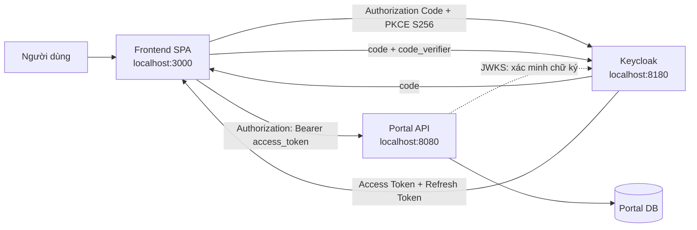
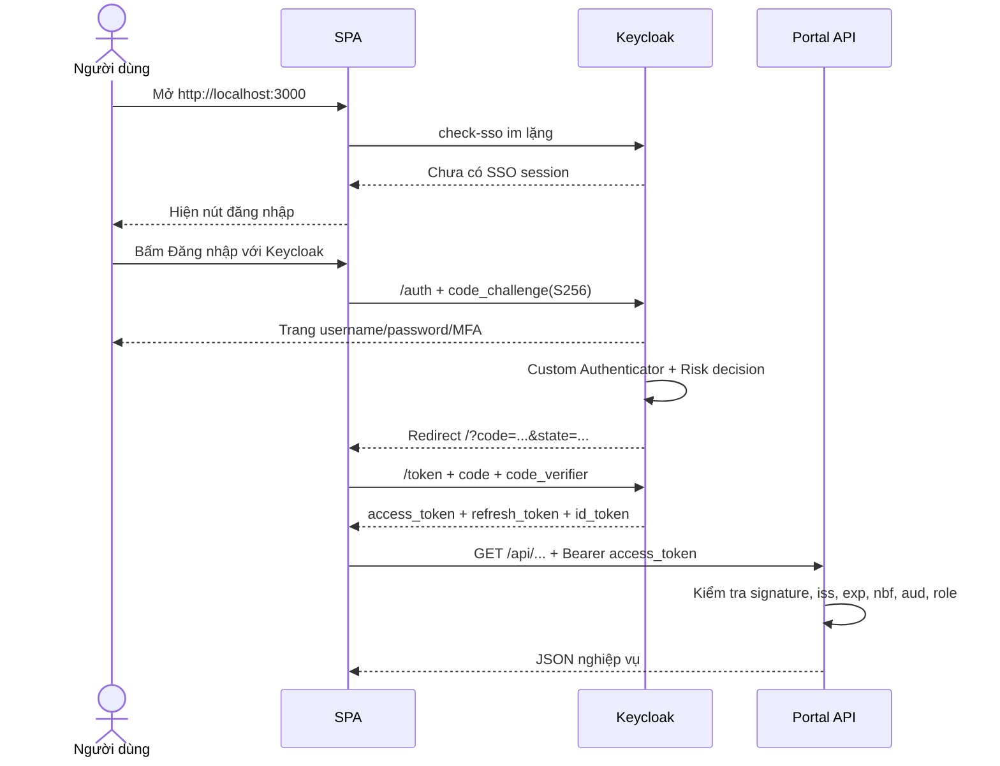

# Luồng đăng nhập SPA + PKCE

**Trạng thái:** Đã chấp nhận (Accepted)

**Ngày cập nhật:** 2026-09-04

**Nhánh triển khai:** `zerotrust-v3-spa`

Tài liệu này là nguồn sự thật cho luồng đăng nhập, refresh token và logout của Portal. Kiến trúc hiện tại là SPA dùng Authorization Code Flow + PKCE; Spring Boot chỉ là OAuth2 Resource Server stateless, không còn là BFF.

## 1. Kiến trúc đã chốt



Phân chia trách nhiệm:

- Frontend điều hướng người dùng sang Keycloak, xử lý callback, giữ token trong memory, refresh và gắn Bearer token vào request.
- Keycloak kiểm tra mật khẩu, MFA, risk authentication flow và phát hành token.
- Portal API không đăng nhập người dùng. API chỉ xác minh access token và kiểm tra quyền.
- Redis không còn cần cho phiên Portal. Redis trong `ARCHITECTURE.md` chỉ phục vụ Risk Scoring Service.
- Client `zerotrust-provisioner` vẫn là confidential service account riêng để backend tạo/quản lý tài khoản Keycloak. Nó không tham gia đăng nhập trình duyệt.

## 2. Vì sao không có `/auth/login`

Frontend không gửi username/password tới Portal API. Nút đăng nhập gọi:

```ts
getKeycloak().login({ redirectUri: appRedirectUri() });
```

Code nằm trong `frontend/app/page.tsx`. `keycloak-js` tạo authorization request và chuyển trình duyệt trực tiếp tới authorization endpoint của Keycloak. Vì vậy:

- không cần và không được tạo `POST /auth/login`;
- Portal API không nhìn thấy mật khẩu hoặc OTP;
- chỉ Keycloak chịu trách nhiệm xác thực;
- Custom Authenticator/Risk Scoring trong Keycloak vẫn chạy như trước khi Keycloak phát hành code.

## 3. PKCE bảo vệ điều gì

Trước khi redirect, `keycloak-js` tạo một chuỗi bí mật ngẫu nhiên gọi là `code_verifier`, rồi băm SHA-256 thành `code_challenge`.

1. Authorization request chỉ gửi `code_challenge` tới Keycloak.
2. Sau đăng nhập, Keycloak redirect về SPA với authorization code dùng một lần.
3. SPA đổi code lấy token và phải gửi đúng `code_verifier`.
4. Keycloak tự băm verifier và so sánh với challenge đã lưu.

Nếu authorization code bị chặn hoặc bị lấy khỏi URL, kẻ tấn công vẫn không đổi được code thành token vì không có verifier. SPA là public client, không thể giữ client secret an toàn, nên PKCE S256 là lớp bảo vệ bắt buộc thay cho việc giả vờ giấu secret trong JavaScript.

PKCE không chống XSS. XSS vẫn có thể đọc token đang nằm trong memory hoặc gọi API dưới danh nghĩa người dùng. Vì vậy frontend vẫn cần CSP, kiểm soát dependency, không render HTML không tin cậy và tránh lưu token lâu dài.

## 4. Luồng login chi tiết theo code



Code flow:

1. `frontend/lib/keycloak.ts` tạo singleton Keycloak với URL, realm và public client ID.
2. `initializeKeycloak()` gọi `init` với `onLoad: 'check-sso'`, `pkceMethod: 'S256'` và silent SSO page.
3. Nếu chưa đăng nhập, `frontend/app/page.tsx` hiển thị màn hình login.
4. `login()` redirect sang Keycloak. Đoạn redirect nằm ở hàm `login` cuối `page.tsx`, không nằm trong backend.
5. Khi Keycloak redirect về `/`, lời gọi `init()` tự kiểm tra `state`, dùng verifier để đổi code lấy token và xử lý callback.
6. Frontend lấy `preferred_username` và `realm_access.roles` từ token để hiển thị UI. Đây chỉ là kiểm tra UX; backend luôn kiểm tra role lại.
7. `frontend/lib/api.ts` gọi `apiFetch()`, refresh nếu cần rồi thêm header `Authorization: Bearer ...`.
8. `SecurityConfig` bật Resource Server, tạo session policy `STATELESS`, xác minh JWT và bảo vệ endpoint theo role.
9. `KeycloakJwtAuthenticationConverter` đổi `realm_access.roles = ["admin"]` thành `ROLE_ADMIN` cho Spring Security.
10. `StudentController` và `UserController` lấy `sub` trực tiếp từ principal `Jwt` để liên kết với `users.keycloak_user_id`.

## 5. Token được lưu ở đâu

`keycloak-js` giữ access token, refresh token và ID token trong biến JavaScript của tab hiện tại. Code không ghi token vào:

- `localStorage`;
- `sessionStorage`;
- IndexedDB;
- cookie do JavaScript tạo;
- URL hoặc log ứng dụng.

Reload tab sẽ mất token trong memory. `check-sso` dùng SSO session của Keycloak để khôi phục đăng nhập mà không yêu cầu nhập lại mật khẩu nếu Keycloak session còn hiệu lực.

Đây là đánh đổi chính của SPA: tránh rủi ro token tồn tại lâu trong storage, nhưng XSS chạy trong tab vẫn có thể lợi dụng token hiện tại. Access token nên có TTL ngắn, ví dụ khoảng 5 phút; giới hạn cuối cùng phải được cấu hình tại Keycloak theo yêu cầu đồ án.

## 6. Refresh token nằm ở đoạn nào

Refresh nằm trong `frontend/lib/api.ts`, hàm `refreshToken()`:

```ts
await keycloak.updateToken(30);
```

Trước mỗi API request, token được refresh nếu còn dưới 30 giây. Các request đồng thời dùng chung `refreshInFlight` để không gửi nhiều refresh request song song.

Nếu API trả 401, `apiFetch()` force refresh đúng một lần bằng `updateToken(-1)` rồi retry request đúng một lần. Nếu refresh thất bại, token trong memory bị xóa và UI quay về trạng thái chưa đăng nhập. Không retry vô hạn.

Refresh token rotation, reuse detection và thời hạn SSO phải được cấu hình ở Keycloak. SPA không tự phát hành hoặc tự xác minh refresh token.

## 7. Backend xác minh access token

`SecurityConfig` và `JwtAudienceValidator` kiểm tra:

- chữ ký JWT qua JWKS của realm;
- `iss` đúng `KEYCLOAK_ISSUER_URI`;
- token chưa hết hạn và hợp lệ theo thời gian;
- `aud` có `zerotrust-api` hoặc giá trị `KEYCLOAK_API_AUDIENCE`;
- realm role phù hợp với endpoint.

Quyền hiện tại:

```text
/api/admin/**      -> ROLE_ADMIN
/api/students/**   -> ROLE_STUDENT
/api/users/**      -> JWT hợp lệ
mọi đường dẫn khác -> deny
```

`/api/users/me` và truy vấn điểm của sinh viên còn kiểm tra liên kết `sub` với Portal DB; tài khoản Portal không `ACTIVE` bị từ chối. Tài khoản quản trị được quản lý trạng thái enabled/disabled tại Keycloak.

Portal không introspect Keycloak ở mỗi request. Việc khóa tài khoản/thu hồi role có hiệu lực với API khi access token hiện tại hết hạn hoặc bị thay thế, nên access token phải có TTL ngắn.

## 8. CORS và CSRF

SPA ở origin `http://localhost:3000` gọi API ở `http://localhost:8080`, nên browser áp dụng CORS. Backend chỉ cho phép origin trong `CORS_ALLOWED_ORIGINS`, các method cần thiết và ba header `Authorization`, `Content-Type`, `Accept`.

Không dùng `allowedOrigins=*` trong production. Production phải dùng HTTPS và khai báo origin đầy đủ, ví dụ `https://portal.example.edu`.

CSRF được tắt vì Portal API chỉ nhận Bearer token trong header và không dùng cookie để xác thực. Browser không tự gắn Bearer token vào request từ website khác. Nếu sau này thêm bất kỳ cookie xác thực nào, quyết định này phải được xem lại và cần CSRF protection tương ứng.

CORS không phải cơ chế xác thực: client ngoài browser vẫn gọi được API. JWT validation và authorization mới là hàng rào bảo mật thật.

## 9. Luồng logout

Nút logout ở `frontend/app/page.tsx` gọi:

```ts
keycloak.logout({ redirectUri: appRedirectUri() });
```

Trình duyệt được đưa tới end-session endpoint của Keycloak. Keycloak kết thúc SSO session rồi redirect về SPA. `keycloak-js` xóa token trong memory. Nếu Keycloak không phản hồi, frontend vẫn dọn token cục bộ, nhưng logout toàn cục chỉ hoàn tất khi end-session request thành công.

Backend không có `/api/auth/logout` vì backend không giữ session và không giữ token của người dùng.

## 10. Cấu hình client Keycloak bắt buộc

Tạo OIDC client `zerotrust-spa` trong realm `DoAn`:

- Client authentication: `Off` (public client).
- Standard flow: `On`.
- Implicit flow: `Off`.
- Direct access grants: `Off`.
- Service accounts roles: `Off`.
- PKCE method/code challenge method: `S256`.
- Valid redirect URIs: `http://localhost:3000/` và `http://localhost:3000/silent-check-sso.html`.
- Valid post logout redirect URIs: `http://localhost:3000/`.
- Web origins: `http://localhost:3000`.

Thêm Audience protocol mapper vào token của `zerotrust-spa`:

- Mapper type: `Audience`.
- Included Custom Audience: `zerotrust-api`.
- Add to access token: `On`.
- Add to ID token: không bắt buộc.

Access token phải chứa ít nhất:

```json
{
  "iss": "http://localhost:8180/realms/DoAn",
  "aud": ["zerotrust-api"],
  "sub": "<UUID user Keycloak>",
  "preferred_username": "admin01",
  "realm_access": { "roles": ["ADMIN"] }
}
```

Không cấu hình client secret cho SPA và không đặt secret trong biến `NEXT_PUBLIC_*`; mọi biến public đều có thể được đọc từ browser bundle.

## 11. Biến môi trường

Frontend xem `frontend/.env.example`:

```properties
NEXT_PUBLIC_KEYCLOAK_URL=http://localhost:8180
NEXT_PUBLIC_KEYCLOAK_REALM=DoAn
NEXT_PUBLIC_KEYCLOAK_CLIENT_ID=zerotrust-spa
NEXT_PUBLIC_API_BASE_URL=http://localhost:8080
```

Backend:

```properties
KEYCLOAK_ISSUER_URI=http://localhost:8180/realms/DoAn
KEYCLOAK_JWK_SET_URI=http://localhost:8180/realms/DoAn/protocol/openid-connect/certs
KEYCLOAK_API_AUDIENCE=zerotrust-api
CORS_ALLOWED_ORIGINS=http://localhost:3000
```

`KEYCLOAK_ADMIN_CLIENT_SECRET` chỉ thuộc client service account `zerotrust-provisioner`, không được dùng ở frontend.

## 12. Mã lỗi quan trọng

```text
401 UNAUTHORIZED -> thiếu/sai/hết hạn token, sai issuer, signature hoặc audience
403 FORBIDDEN    -> JWT hợp lệ nhưng thiếu role cho endpoint
403 USER_INACTIVE -> hồ sơ Portal của sinh viên không ACTIVE
404 USER_NOT_FOUND -> sub không có hồ sơ Portal tương ứng
```

## 13. Checklist trước khi demo

- [ ] Client `zerotrust-spa` là public client và chỉ bật Standard Flow.
- [ ] PKCE bắt buộc là S256.
- [ ] Redirect URI, post-logout URI và Web Origin khớp chính xác môi trường.
- [ ] Access token có audience `zerotrust-api` và realm role cần thiết.
- [ ] Token không xuất hiện trong browser storage hoặc log.
- [ ] API không tạo `JSESSIONID` và không có Redis session.
- [ ] Request không Bearer token trả 401 JSON.
- [ ] STUDENT gọi `/api/admin/**` trả 403 JSON.
- [ ] Origin ngoài allow-list không nhận CORS header.
- [ ] Access token hết hạn được refresh; refresh thất bại quay lại login.
- [ ] Logout đi qua Keycloak và trở về SPA.
- [ ] Production dùng HTTPS cho SPA, API và Keycloak.
