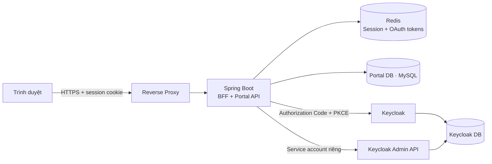

# Luồng đăng nhập production V1

**Trạng thái:** Đã chấp nhận (Accepted)  
**Ngày chốt:** 2026-08-26  
**Phạm vi:** Toàn bộ đăng nhập, phiên người dùng, mật khẩu, email, MFA và phân quyền của phiên bản V1 chưa có Risk Score Service

## 1. Quyền ưu tiên của tài liệu

Đây là **nguồn sự thật duy nhất** cho việc thiết kế và triển khai luồng đăng nhập V1.

Nếu nội dung về đăng nhập trong tài liệu khác, kể cả `ARCHITECTURE.md`, mâu thuẫn với file này thì **`LOGIN_FLOW.md` được ưu tiên cho V1**. Các phần Risk Scoring, Custom Authenticator và adaptive authentication trong `ARCHITECTURE.md` chỉ là kiến trúc V2 tương lai, chưa thuộc phạm vi triển khai hiện tại.

Không được tự ý thay đổi luồng này. Mọi thay đổi phải:

1. Nêu rõ lý do và tác động.
2. Được chủ đồ án chấp thuận rõ ràng.
3. Cập nhật file này trước hoặc cùng lúc với code.

## 2. Các quyết định đã chốt

V1 sử dụng:

- OpenID Connect Authorization Code Flow.
- PKCE với `S256`.
- Spring Boot làm BFF và Portal API trong cùng hệ thống triển khai.
- Keycloak chịu trách nhiệm xác thực username, password và MFA.
- Redis lưu session phía server.
- Trình duyệt chỉ giữ session cookie; không giữ Access Token hoặc Refresh Token.
- Admin tự nhập email và mật khẩu khi tạo sinh viên, đúng như API hiện tại.
- Email không được tự sinh.
- Email không cần xác minh trong V1.
- Mật khẩu do admin đặt là mật khẩu chính thức, `temporary=false`.
- Sinh viên không bị bắt đổi mật khẩu ở lần đăng nhập đầu tiên.
- Không có Risk Score Service, Custom Authenticator hoặc quyết định rủi ro thích ứng trong V1.
- MFA áp dụng theo chính sách cố định, không phụ thuộc Risk Score.

## 3. Kiến trúc V1



Frontend và API phải được đưa ra ngoài qua cùng một site, ví dụ:

```text
https://app.example.com/       -> frontend
https://app.example.com/api/** -> Spring Boot
https://auth.example.com/      -> Keycloak public login
```

Keycloak Admin Console và Admin REST API không được công khai chung với hostname đăng nhập nếu triển khai thật.

## 4. Hai Keycloak client bắt buộc tách riêng

### 4.1. `zerotrust-bff`

Client dùng cho người dùng đăng nhập:

```text
Client type / capability: Confidential
Client authentication: ON
Standard flow: ON
PKCE method: S256
Implicit flow: OFF
Direct access grants: OFF
Service accounts: OFF
```

Redirect URI phải khai báo chính xác, không dùng wildcard rộng:

```text
https://app.example.com/login/oauth2/code/keycloak
```

### 4.2. `zerotrust-provisioner`

Client chỉ dùng để backend tạo user, đặt mật khẩu và gán realm role:

```text
Client authentication: ON
Service accounts: ON
Standard flow: OFF
Implicit flow: OFF
Direct access grants: OFF
```

Client này chỉ được cấp các quyền Keycloak Admin tối thiểu cần thiết. Không dùng chung client secret với `zerotrust-bff`.

## 5. Luồng tạo tài khoản sinh viên

Luồng hiện tại được giữ nguyên về email và mật khẩu:

1. Admin đã đăng nhập bằng role `ADMIN`.
2. Admin gọi `POST /api/admin/students`.
3. Admin nhập trực tiếp `username`, `email` và `password` của sinh viên.
4. Backend kiểm tra dữ liệu và tính duy nhất của username, email, mã sinh viên.
5. Backend dùng client `zerotrust-provisioner` để tạo user trong Keycloak.
6. Keycloak lưu credential với `temporary=false`.
7. Backend gán realm role `STUDENT`.
8. Backend lưu hồ sơ vào Portal DB cùng `keycloak_user_id` trả về từ Keycloak.
9. Portal DB tuyệt đối không lưu password.
10. Nếu lưu Portal DB thất bại, backend phải rollback/xóa user Keycloak vừa tạo.

Quyết định riêng của đồ án:

- Không tự sinh email.
- Không gửi email kích hoạt.
- Không yêu cầu `VERIFY_EMAIL`.
- Không yêu cầu `UPDATE_PASSWORD` khi đăng nhập lần đầu.
- Admin giao username/password cho sinh viên bằng kênh trực tiếp ngoài hệ thống.

Password không được xuất hiện trong response, log, audit payload, exception hoặc database của Portal.

## 6. Chính sách email V1

Email tiếp tục là trường do admin nhập và được lưu như code hiện tại.

Cấu hình Keycloak V1:

```text
Verify Email: OFF
Email as username: OFF
Login with email: OFF
Forgot Password qua email: OFF
```

Người dùng đăng nhập bằng `username`, không đăng nhập bằng email. Hệ thống không tự sửa, thay thế hoặc sinh email.

## 7. Chính sách mật khẩu V1

Admin đặt mật khẩu chính thức khi tạo sinh viên:

```java
password.setTemporary(false);
```

Không yêu cầu đổi mật khẩu ở lần đăng nhập đầu tiên.

Password policy tối thiểu trên Keycloak:

```text
Độ dài tối thiểu: 12 ký tự
Có chữ hoa
Có chữ thường
Có chữ số
Có ký tự đặc biệt
Không trùng username
Không thuộc danh sách mật khẩu phổ biến nếu môi trường hỗ trợ
```

Sau khi tạo tài khoản:

- Không có API đọc lại mật khẩu.
- Giao diện phải xóa password khỏi form/state.
- Sinh viên có thể chủ động đổi mật khẩu sau khi đăng nhập nhưng không bị bắt buộc.

## 8. Quên hoặc reset mật khẩu khi không có email thật

V1 không dùng email reset password.

Luồng reset:

1. Sinh viên liên hệ admin ngoài hệ thống.
2. Admin xác minh sinh viên theo quy trình của đồ án.
3. Admin đặt một mật khẩu mới qua Keycloak Admin API.
4. Mật khẩu reset tiếp tục là mật khẩu chính thức với `temporary=false`.
5. Không ép đổi mật khẩu ở lần đăng nhập sau reset.

API dự kiến khi triển khai:

```http
POST /api/admin/students/{studentId}/reset-password
```

Không được triển khai Forgot Password dựa trên email giả khi chưa có phê duyệt thay đổi tài liệu này.

## 9. Chính sách MFA cố định V1

V1 chưa có Risk Score nên không có quyết định `ALLOW`, `STEP_UP_MFA`, `DENY` dựa trên điểm rủi ro.

Chính sách cố định:

- `ADMIN`: bắt buộc MFA; ưu tiên WebAuthn/Passkey, có thể dùng TOTP cho đồ án.
- `STUDENT`: bắt buộc cấu hình TOTP ở lần đăng nhập đầu tiên và dùng TOTP ở các phiên đăng nhập tiếp theo.
- Việc cấu hình TOTP lần đầu không đồng nghĩa với đổi mật khẩu.
- Bật Brute Force Detection trên Keycloak.

Không được tự thêm thu thập fingerprint, IP risk, geolocation risk, login velocity hoặc gọi Risk Score Service trong V1.

## 10. Luồng đăng nhập chi tiết

```mermaid
sequenceDiagram
    actor U as Người dùng
    participant B as Trình duyệt
    participant A as Spring Boot BFF
    participant R as Redis
    participant K as Keycloak

    U->>B: Mở ứng dụng
    B->>A: GET /api/auth/session
    A-->>B: Chưa có session
    B->>A: GET /oauth2/authorization/keycloak
    A->>A: Tạo state, nonce, PKCE verifier/challenge
    A-->>B: Redirect tới Keycloak /authorize
    B->>K: Authorization request + code_challenge S256
    K->>U: Form username/password + MFA
    U->>K: Credentials + OTP/Passkey
    K-->>B: Redirect callback với authorization code
    B->>A: GET /login/oauth2/code/keycloak?code=...
    A->>K: POST /token với code + verifier + client authentication
    K-->>A: ID Token + Access Token + Refresh Token
    A->>R: Lưu session và OAuth tokens phía server
    A-->>B: Set-Cookie __Host-session; redirect về ứng dụng
    B->>A: GET /api/auth/session + session cookie
    A-->>B: Thông tin user và role
    B->>A: Gọi API + session cookie + CSRF token nếu cần
    A-->>B: Kết quả API
```

Trình duyệt không gọi `/token`. Chỉ Spring Boot BFF gọi `/token` từ phía server.

## 11. Session, cookie và CSRF

Session được lưu trong Redis. Access Token, Refresh Token và dữ liệu OAuth authorized client không được ghi vào cookie phía trình duyệt.

Cookie phiên:

```text
Name: __Host-session
Secure: true
HttpOnly: true
SameSite: Lax
Path: /
Domain: không đặt
```

`SameSite=Lax` được chốt để callback điều hướng từ Keycloak về ứng dụng hoạt động ổn định. Các request thay đổi dữ liệu vẫn phải được bảo vệ bằng CSRF token.

CSRF:

- Không được giữ `csrf.disable()` khi chuyển sang BFF cookie session.
- `POST`, `PUT`, `PATCH`, `DELETE` phải yêu cầu CSRF token.
- Frontend gửi token bằng header, ví dụ `X-CSRF-TOKEN`.
- Session cookie vẫn luôn `HttpOnly`; CSRF token không phải Access Token.

## 12. Refresh token và thời gian phiên

Cấu hình khởi đầu V1:

```text
Access Token Lifespan: 5 phút
Session Idle: 30 phút
Session Max: 8 giờ
Refresh Token Rotation / Revoke Refresh Token: ON
Offline Access: OFF
Remember Me: OFF ở V1
```

Khi Access Token gần hết hạn, BFF tự dùng Refresh Token để lấy token mới và lưu lại token đã rotate trong Redis. Frontend không thực hiện refresh.

Khi Refresh Token hết hạn hoặc bị thu hồi:

1. BFF hủy session Redis.
2. Xóa session cookie.
3. Trả trạng thái chưa đăng nhập để frontend bắt đầu Authorization Code Flow mới.

## 13. Khởi tạo giao diện sau đăng nhập

Sau khi login thành công, frontend gọi:

```http
GET /api/auth/session
```

Response phải chứa tối thiểu:

```json
{
  "authenticated": true,
  "username": "student01",
  "roles": ["STUDENT"]
}
```

Frontend điều hướng theo role:

```text
ADMIN   -> trang quản trị
STUDENT -> trang sinh viên
```

Các API nghiệp vụ hiện tại giữ nguyên đường dẫn, ví dụ:

```http
GET /api/users/me
GET /api/students/me/scores
GET /api/admin/students
```

Browser gọi các API này bằng session cookie, không gửi Bearer Token từ JavaScript.

## 14. Kiểm tra quyền và trạng thái tài khoản

Keycloak xác thực danh tính và cung cấp realm role. Portal vẫn phải kiểm tra quyền trên từng tài nguyên:

- `STUDENT` chỉ xem dữ liệu và điểm của chính mình.
- `ADMIN` quản lý sinh viên, lớp, môn học và điểm.
- Tài khoản `INACTIVE` hoặc `DELETED` trong Portal DB bị từ chối dù Keycloak session vẫn còn hợp lệ.
- `sub` từ danh tính OIDC được đối chiếu với `users.keycloak_user_id`.

Không được nhận `studentId` từ client cho API xem điểm của chính sinh viên. Endpoint `/api/students/me/scores` luôn tự suy ra sinh viên từ danh tính đăng nhập.

## 15. Logout

Logout phải dùng request thay đổi trạng thái và có CSRF protection:

```http
POST /api/auth/logout
```

Backend phải:

1. Hủy session Redis.
2. Xóa `__Host-session` cookie.
3. Kết thúc hoặc thu hồi session tương ứng trên Keycloak.
4. Redirect hoặc trả URL để frontend về trang chưa đăng nhập.

Chỉ xóa cookie phía frontend mà không kết thúc session server/Keycloak không được xem là logout hoàn chỉnh.

## 16. Xử lý lỗi chuẩn

```text
401 Unauthorized -> chưa đăng nhập, session/token không hợp lệ hoặc hết hạn
403 Forbidden    -> đã đăng nhập nhưng không có role/quyền
USER_INACTIVE    -> tài khoản Portal bị khóa
STUDENT_NOT_FOUND -> tài khoản Keycloak chưa liên kết hồ sơ sinh viên
```

Không được phân biệt thông báo username sai và password sai trên màn hình đăng nhập. Không ghi credential hoặc token vào log lỗi.

## 17. Thay đổi bắt buộc so với code hiện tại

Code hiện tại vẫn là OAuth2 Resource Server stateless nhận Bearer Token từ frontend. Đây là trạng thái trung gian, chưa phải kiến trúc đích V1 trong file này.

Khi triển khai login BFF phải:

1. Thêm `spring-boot-starter-oauth2-client`.
2. Thêm Spring Session Redis.
3. Cấu hình `oauth2Login()` với client `zerotrust-bff`.
4. Đổi `SessionCreationPolicy.STATELESS` sang session server-side phù hợp.
5. Bật lại CSRF protection.
6. Thay principal `Jwt` ở controller trình duyệt bằng `OidcUser` hoặc `OAuth2AuthenticationToken`.
7. Ánh xạ realm roles của Keycloak sang Spring authorities.
8. Lưu OAuth authorized client và session trong Redis.
9. Frontend bỏ hoàn toàn việc lưu/gửi Bearer Token.
10. Frontend dùng `credentials: "include"` và CSRF token khi gọi API thay đổi dữ liệu.

Không được triển khai nửa BFF, nửa SPA token flow nếu chưa thiết kế rõ các `SecurityFilterChain` tách biệt và được chủ đồ án chấp thuận.

## 18. Những điều bị cấm trong V1

- Không tạo `POST /api/auth/login` nhận username/password.
- Không dùng Resource Owner Password Credentials Grant (`grant_type=password`).
- Không bật Direct Access Grants cho client đăng nhập.
- Không dùng Implicit Flow.
- Không để frontend gọi trực tiếp `/token`.
- Không lưu Access Token hoặc Refresh Token trong `localStorage`, `sessionStorage`, IndexedDB hoặc cookie do JavaScript đọc được.
- Không lưu password trong Portal DB.
- Không ghi password, token, authorization code hoặc client secret vào log.
- Không tự sinh email.
- Không bắt xác minh email.
- Không gửi email kích hoạt trong V1.
- Không dùng temporary password khi tạo sinh viên.
- Không bắt sinh viên đổi mật khẩu ở lần đăng nhập đầu tiên.
- Không tự thêm Risk Score Service, Custom Authenticator hoặc adaptive decision vào V1.
- Không tự thay đổi đường dẫn API nghiệp vụ chỉ để phục vụ login.

## 19. Chuẩn bị cho V2 Risk Scoring nhưng chưa triển khai

V1 có thể ghi audit event tối thiểu mà không đưa ra quyết định rủi ro:

```text
LOGIN_SUCCESS
LOGIN_FAILURE
MFA_SUCCESS
MFA_FAILURE
TOKEN_REFRESH
LOGOUT
ACCOUNT_LOCKED
```

Các event này chỉ dùng cho audit ở V1. Không tính Risk Score, không phân loại `LOW/MEDIUM/HIGH`, không step-up theo rủi ro và không deny dựa trên mô hình rủi ro.

Khi bắt đầu V2, phải có phê duyệt mới và cập nhật file này trước khi thêm Risk Scoring vào authentication flow.

## 20. Checklist nghiệm thu login V1

- [ ] Login dùng Authorization Code + PKCE S256.
- [ ] Browser không thấy Access Token hoặc Refresh Token.
- [ ] Session và OAuth tokens nằm trong Redis.
- [ ] Cookie có `Secure`, `HttpOnly`, `SameSite=Lax`, `Path=/`, không có `Domain`.
- [ ] CSRF được bật cho request thay đổi dữ liệu.
- [ ] Direct Access Grants và Implicit Flow đã tắt.
- [ ] `zerotrust-bff` và `zerotrust-provisioner` là hai client riêng.
- [ ] Admin nhập email và password; hệ thống không tự sinh email.
- [ ] Email verification đã tắt.
- [ ] Credential tạo mới có `temporary=false`.
- [ ] Không có required action `UPDATE_PASSWORD` khi tạo sinh viên.
- [ ] MFA cố định hoạt động cho ADMIN và STUDENT.
- [ ] Brute Force Detection đã bật.
- [ ] `/api/students/me/scores` chỉ trả điểm của danh tính hiện tại.
- [ ] Account `INACTIVE` hoặc `DELETED` bị chặn.
- [ ] Logout hủy session BFF và session Keycloak.
- [ ] HTTPS hoạt động trên toàn bộ đường truyền public.
- [ ] Không có Risk Score Service trong V1.

## 21. Tham chiếu tiêu chuẩn

- OAuth 2.0 for Browser-Based Applications — RFC 10017: https://www.rfc-editor.org/rfc/rfc10017.html
- OAuth 2.0 Security Best Current Practice — RFC 9700: https://www.rfc-editor.org/rfc/rfc9700.html
- Keycloak production configuration: https://www.keycloak.org/server/configuration-production
- Keycloak Server Administration Guide: https://www.keycloak.org/docs/latest/server_admin/
