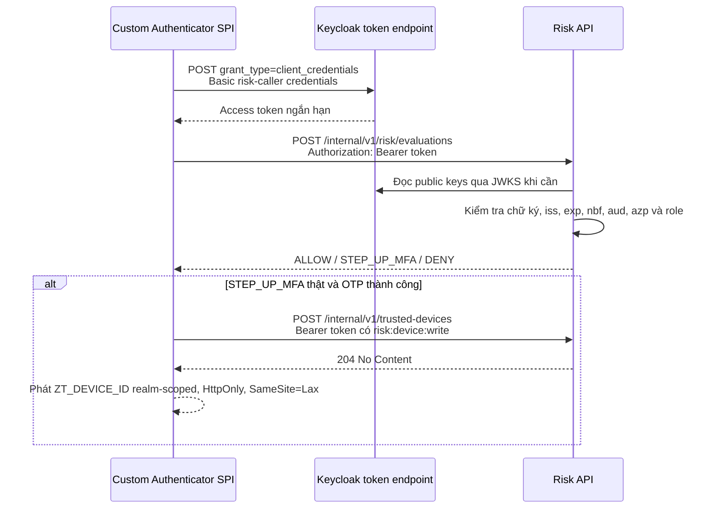

# Bảo vệ kết nối Keycloak đến Risk API

**Trạng thái:** Đã bảo vệ API, xác minh service token và kiểm thử thành công luồng post-MFA end-to-end trên môi trường local
**Ngày cập nhật:** 2026-09-17

Tài liệu này ghi lại cấu hình và luồng bảo vệ service-to-service giữa Custom
Authenticator chạy trong Keycloak và `risk-scoring-service`.

## 1. Phương án đã chốt

Kết nối sử dụng OAuth 2.0 Client Credentials, Bearer access token ngắn hạn, TLS
và giới hạn mạng nội bộ. Hai client trong realm `DoAn` có trách nhiệm tách biệt:

| Client | Loại | Trách nhiệm |
|---|---|---|
| `zerotrust-risk-api` | Resource/audience client, không có service account | Định danh Risk API; chứa `risk:evaluate`, `risk:device:write`, `risk:events:write` |
| `zerotrust-risk-caller` | Confidential client, bật Service accounts roles | Danh tính máy của Keycloak extension khi gọi Risk API |

Service account của `zerotrust-risk-caller` đã được gán chính xác ba client role
`zerotrust-risk-api / risk:evaluate`, `zerotrust-risk-api / risk:device:write` và
`zerotrust-risk-api / risk:events:write`. Dedicated role scope của caller cũng chỉ
cho phép ba role này; `Full scope allowed` vẫn tắt. Client này không thay thế
`zerotrust-provisioner`: provisioner quản trị user qua Keycloak Admin API, còn
risk caller chỉ được gọi các endpoint Risk API tương ứng với role đã cấp.

Service token Client Credentials đã được kiểm tra ngày 2026-09-15 và có cấu trúc
claim như sau:

```json
{
  "iss": "http://localhost:8180/realms/DoAn",
  "aud": "zerotrust-risk-api",
  "azp": "zerotrust-risk-caller",
  "resource_access": {
    "zerotrust-risk-api": {
      "roles": ["risk:evaluate", "risk:device:write", "risk:events:write"]
    }
  }
}
```

Audience hiện được Keycloak tạo bằng audience resolution từ client role. Không
cần thêm một audience mapper thứ hai nếu token evaluate đã có đúng
`aud=zerotrust-risk-api`.

Lần xác minh mới nhất đã lấy token thành công mà không ghi client secret hoặc
access token ra log. Các kiểm tra `iss`, `aud`, `azp`, `exp`, `risk:evaluate`,
`risk:device:write` và `risk:events:write` đều đạt.

`iss` phụ thuộc hostname/port mà Keycloak nhận ở token request. Trong topology
local hiện tại, extension chạy trong container và gọi `localhost:8080`, nên token
runtime có `iss=http://localhost:8080/realms/DoAn`. Risk Service phải cấu hình
issuer đúng tuyệt đối với giá trị này; URL JWKS có thể dùng cổng host `8180`.
Token xin trực tiếp qua cổng browser `8180` có issuer `8180` và bị Risk Service
cấu hình issuer `8080` từ chối đúng bằng `401`. Đây là giới hạn của `start-dev`
và hostname động trong môi trường local, không phải cấu hình được chấp nhận cho
production.

## 2. Luồng runtime



Extension cache token theo token endpoint và client ID, làm mới trước khi hết
hạn 30 giây. Nếu Risk API trả `401`, extension xóa đúng token bị từ chối, xin
token mới và gọi lại đúng một lần. Client secret và access token không được ghi
vào log.

## 3. Điều kiện Risk API chấp nhận request

Mọi request nội bộ chỉ được xử lý khi đồng thời thỏa mãn:

1. JWT có chữ ký hợp lệ theo JWKS của realm `DoAn`.
2. `iss` đúng issuer đã cấu hình.
3. Token có `exp`, chưa hết hạn và chưa vi phạm `nbf`.
4. `aud` chứa `zerotrust-risk-api`.
5. `azp` bằng `zerotrust-risk-caller`.
6. `resource_access.zerotrust-risk-api.roles` chứa role đúng với thao tác:
   `risk:evaluate` cho `POST /internal/v1/risk/evaluations`,
   `risk:device:write` cho `POST /internal/v1/trusted-devices`, hoặc
   `risk:events:write` cho `POST /internal/v1/authentication-failures` và
   `POST /internal/v1/authentication-successes`.

Thiếu hoặc sai token trả `401`. Token hợp lệ nhưng sai caller/role trả `403`.
Ba role không thay thế cho nhau. Role trùng tên nằm trong realm role hoặc client
khác không cấp quyền gọi API.
Ngoài `GET /actuator/health`, các path và method khác đều bị từ chối.

## 4. Cấu hình chạy local

Topology local đã kiểm tra là Keycloak chạy trong Docker, publish
`localhost:8180`, Risk DB chạy trong Docker ở `127.0.0.1:3307`, còn Risk Service
chạy trên Windows ở port `8081`. Lần đầu tạo `.env` từ file mẫu và thay mọi
placeholder bằng secret ngẫu nhiên:

```powershell
Copy-Item .env.example .env
# Thay các placeholder trong .env, sau đó:
docker compose up -d risk-db risk-redis
.\run-risk-local.ps1
```

Script chỉ truyền các biến dành cho Risk Service sang tiến trình Java; root
password của MySQL không được truyền. Risk DB dùng user `risk_service`, named
volume `risk-db-data`, image MySQL 8.0.46 tương thích với Flyway hiện tại và chỉ
publish trên loopback.

`0.0.0.0` chỉ cần thiết để container Keycloak gọi được service trên host. Đây là
cấu hình development; không expose port `8081` ra mạng không tin cậy.

Execution `ZeroTrust Risk Evaluation` trong flow `zerotrust-browser` hiện đã lưu:

```text
Risk Service base URL:
  http://host.docker.internal:8081
Keycloak token endpoint URL:
  http://localhost:8080/realms/DoAn/protocol/openid-connect/token
Risk caller client ID:
  zerotrust-risk-caller
Risk caller client secret:
  secret lấy từ tab Credentials của zerotrust-risk-caller
Token refresh skew:
  30000 ms
Failure mode:
  DENY
```

Nếu Keycloak cũng chạy trực tiếp trên host, đổi Risk Service URL về
`http://localhost:8081`, token endpoint về cổng publish `8180` và issuer của Risk
Service về `http://localhost:8180/realms/DoAn`. Nếu hai service chạy trong hai
container, dùng DNS nội bộ của container cho cả hai chiều kết nối.

## 5. Cấu hình production

Production phải dùng profile `prod` và HTTPS cho cả token endpoint lẫn Risk API:

```text
SPRING_PROFILES_ACTIVE=prod
RISK_JWT_ISSUER_URI=https://<keycloak-host>/realms/DoAn
RISK_JWT_JWK_SET_URI=https://<keycloak-host>/realms/DoAn/protocol/openid-connect/certs
RISK_JWT_AUDIENCE=zerotrust-risk-api
RISK_JWT_ALLOWED_CLIENT_ID=zerotrust-risk-caller
RISK_TLS_KEY_STORE=<path-to-pkcs12>
RISK_TLS_KEY_STORE_PASSWORD=<secret>
RISK_TLS_KEY_ALIAS=<alias>
```

Keycloak production phải cấu hình một canonical HTTPS hostname/issuer cố định.
Frontend, token endpoint, discovery metadata và Risk Service phải thống nhất issuer
này; nếu cần đường backchannel nội bộ, cấu hình hostname/backchannel theo tài liệu
Keycloak thay vì dựa vào `Host` header động. Bật strict hostname resolution và để
reverse proxy ghi đè đúng các forwarded header.

Chỉ cho phép Keycloak/reverse proxy tin cậy kết nối đến Risk Service bằng
firewall, security group hoặc private container network. Client secret phải nằm
trong secret manager hoặc cấu hình server-side có kiểm soát, được xoay vòng định
kỳ và không được commit/export vào repository.

## 6. Trạng thái cài đặt local và việc còn lại

JAR đã được build và chép vào
`keycloak-26.7.0:/opt/keycloak/providers/keycloak-risk-extension.jar`. Keycloak
đã khởi động lại ngày 2026-09-16 và log xác nhận bốn provider được nạp:

```text
zerotrust-risk-authenticator
zerotrust-risk-step-up-condition
zerotrust-device-registration
zerotrust-risk-events
```

Flow `zerotrust-browser` đã được tạo và cấu hình theo thứ tự:

```text
Username Password Form                         REQUIRED
ZeroTrust Risk Evaluation                     REQUIRED
Risk step-up MFA                              CONDITIONAL
  Condition - ZeroTrust step-up required      REQUIRED
  OTP Form                                    REQUIRED
ZeroTrust Remember Device after MFA           REQUIRED
```

Realm `DoAn` đã bind Browser Flow `zerotrust-browser` ngày 2026-09-11. Binding chỉ
được thực thi khi có authentication request mới; SPA đang có token hoặc phiên
Keycloak cũ có thể tiếp tục qua `check-sso`, nên cần logout hoặc dùng cửa sổ riêng
tư khi thử. Risk DB MySQL 8.0.46 hiện healthy, Flyway đã áp dụng migration `V1`,
và Risk Service đang chạy với health `UP`. Phép thử từ
chính container Keycloak đã xác nhận token endpoint trả `200`, Risk API nhận token
hợp lệ trả `200` và quyết định `STEP_UP_MFA / MEDIUM`. Request không có token bị
Risk API chặn bằng `401`.

Execution post-MFA dùng auth-note tham chiếu lại cấu hình của `ZeroTrust Risk
Evaluation`, không sao chép client secret sang cấu hình thứ hai. Nó chỉ đăng ký
thiết bị khi decision thật là `STEP_UP_MFA`; fallback MFA do Risk Service lỗi
không đủ điều kiện tạo trust. Device ID mới có 256 bit entropy. Cookie tồn tại 30
ngày, scope theo realm, `HttpOnly`, `SameSite=Lax`, và dùng `Secure` trong secure
context. Nếu ghi device lỗi sau OTP, login vẫn hoàn tất nhưng cookie không được
phát; `409` làm cookie device cũ hết hạn.

Kiểm thử end-to-end ngày 2026-09-16 xác nhận đăng nhập Portal đi qua
`STEP_UP_MFA`, OTP thành công và thiết bị được ghi nhận là `TRUSTED`. Sau lần
đăng nhập thứ hai trên cùng browser, bảng `known_devices` vẫn chỉ có một row
`TRUSTED`, fingerprint HMAC vẫn dài 64 ký tự, `last_seen_at` được cập nhật và
`version` tăng từ 1 lên 2. Kết quả này xác nhận cookie `ZT_DEVICE_ID` được gửi lại
và endpoint đăng ký hoạt động idempotent. Log Keycloak không có lỗi từ các
provider ZeroTrust trong lần đăng nhập thành công; hai cảnh báo
`invalid_user_credentials` trước đó là hai lần thử nhầm mật khẩu Portal.

Container hiện không mount volume cho `/opt/keycloak/providers`, vì vậy phải cài
lại JAR nếu container bị xóa và tạo mới. Container Keycloak đã được đặt restart
policy `unless-stopped`. Authentication-history đã được tích hợp: phép thử ba lần
sai mật khẩu tạo `AUTHENTICATION_HISTORY_RISK`. Các dải `3/5` theo subject và
`10/20` theo IP là baseline development cần hiệu chỉnh bằng dữ liệu và
false-positive thực tế. Các việc còn lại:

1. Thử login qua cả ba nhánh `ALLOW`, `STEP_UP_MFA`, `DENY` và kiểm tra hành vi
   khi Risk Service ngừng hoạt động. Với `failureMode=DENY`, lỗi service sẽ chặn
   đăng nhập.
2. Cố định canonical Keycloak hostname/issuer và TLS trước khi chuyển khỏi local;
   đưa client secret vào secret manager và có quy trình rotation.
3. Dựng temporal profile và factor từ successful-login events đã thu vào MySQL,
   rồi đánh giá nhu cầu network intelligence. Hiện thiết bị đã `TRUSTED` vẫn phải
   OTP vì phép tính temporal và network feature còn `UNAVAILABLE`, làm evaluation
   có trạng thái `INCOMPLETE` và decision là `STEP_UP_MFA`.

`compose.yaml` hiện quản lý Risk DB và Redis, chưa dựng toàn bộ Keycloak, Portal
API, Risk Service và frontend bằng một lệnh.
