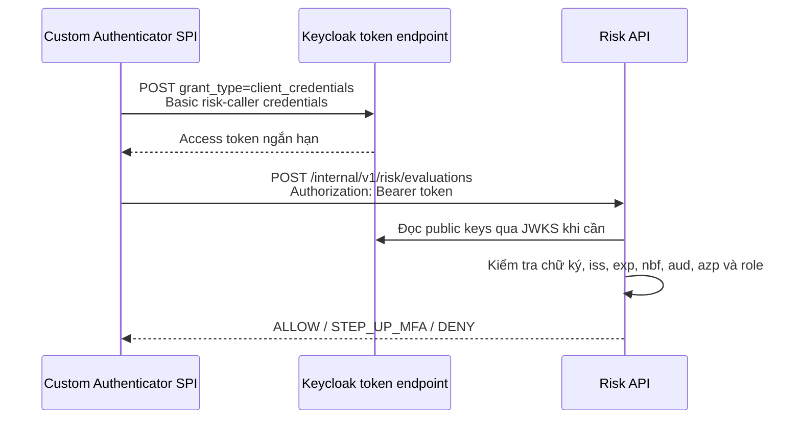

# Bảo vệ kết nối Keycloak đến Risk API

**Trạng thái:** Đã triển khai, cài JAR, cấu hình và bind flow local; đã kiểm tra kết nối service-to-service  
**Ngày cập nhật:** 2026-09-11

Tài liệu này ghi lại cấu hình và luồng bảo vệ service-to-service giữa Custom
Authenticator chạy trong Keycloak và `risk-scoring-service`.

## 1. Phương án đã chốt

Kết nối sử dụng OAuth 2.0 Client Credentials, Bearer access token ngắn hạn, TLS
và giới hạn mạng nội bộ. Hai client trong realm `DoAn` có trách nhiệm tách biệt:

| Client | Loại | Trách nhiệm |
|---|---|---|
| `zerotrust-risk-api` | Resource/audience client, không có service account | Định danh Risk API và chứa client role `risk:evaluate` |
| `zerotrust-risk-caller` | Confidential client, bật Service accounts roles | Danh tính máy của Keycloak extension khi gọi Risk API |

Service account của `zerotrust-risk-caller` chỉ được gán client role
`zerotrust-risk-api / risk:evaluate`. Client này không thay thế
`zerotrust-provisioner`: provisioner quản trị user qua Keycloak Admin API, còn
risk caller chỉ được gọi một endpoint đánh giá rủi ro.

Token đã được kiểm tra có các claim cần thiết. Ví dụ khi token được lấy qua cổng
Keycloak publish trên host:

```json
{
  "iss": "http://localhost:8180/realms/DoAn",
  "aud": "zerotrust-risk-api",
  "azp": "zerotrust-risk-caller",
  "resource_access": {
    "zerotrust-risk-api": {
      "roles": ["risk:evaluate"]
    }
  }
}
```

Audience hiện được Keycloak tạo bằng audience resolution từ client role. Không
cần thêm một audience mapper thứ hai nếu token evaluate đã có đúng
`aud=zerotrust-risk-api`.

`iss` phụ thuộc hostname/port mà Keycloak nhận ở token request. Trong topology
local hiện tại, extension chạy trong container và gọi `localhost:8080`, nên token
runtime có `iss=http://localhost:8080/realms/DoAn`. Risk Service phải cấu hình
issuer đúng tuyệt đối với giá trị này; URL JWKS có thể dùng cổng host `8180`.

## 2. Luồng runtime



Extension cache token theo token endpoint và client ID, làm mới trước khi hết
hạn 30 giây. Nếu Risk API trả `401`, extension xóa đúng token bị từ chối, xin
token mới và gọi lại đúng một lần. Client secret và access token không được ghi
vào log.

## 3. Điều kiện Risk API chấp nhận request

`POST /internal/v1/risk/evaluations` chỉ được xử lý khi đồng thời thỏa mãn:

1. JWT có chữ ký hợp lệ theo JWKS của realm `DoAn`.
2. `iss` đúng issuer đã cấu hình.
3. Token có `exp`, chưa hết hạn và chưa vi phạm `nbf`.
4. `aud` chứa `zerotrust-risk-api`.
5. `azp` bằng `zerotrust-risk-caller`.
6. `resource_access.zerotrust-risk-api.roles` chứa `risk:evaluate`.

Thiếu hoặc sai token trả `401`. Token hợp lệ nhưng sai caller/role trả `403`.
Role trùng tên nằm trong realm role hoặc client khác không cấp quyền gọi API.
Ngoài `GET /actuator/health`, các path và method khác đều bị từ chối.

## 4. Cấu hình chạy local

Topology local đã kiểm tra là Keycloak chạy trong Docker, publish
`localhost:8180`, Risk DB chạy trong Docker ở `127.0.0.1:3307`, còn Risk Service
chạy trên Windows ở port `8081`. Lần đầu tạo `.env` từ file mẫu và thay mọi
placeholder bằng secret ngẫu nhiên:

```powershell
Copy-Item .env.example .env
# Thay các placeholder trong .env, sau đó:
docker compose up -d risk-db
.\run-risk-local.ps1
```

Script chỉ truyền các biến dành cho Risk Service sang tiến trình Java; root
password của MySQL không được truyền. Risk DB dùng user `risk_service`, named
volume `risk-db-data`, image MySQL 8.0.46 tương thích với Flyway hiện tại và chỉ
publish trên loopback.

`0.0.0.0` chỉ cần thiết để container Keycloak gọi được service trên host. Đây là
cấu hình development; không expose port `8081` ra mạng không tin cậy.

Execution `ZeroTrust Risk Evaluation` trong flow `zerotrust-browser` hiện đã lưu:

```text
Risk Service base URL:
  http://host.docker.internal:8081
Keycloak token endpoint URL:
  http://localhost:8080/realms/DoAn/protocol/openid-connect/token
Risk caller client ID:
  zerotrust-risk-caller
Risk caller client secret:
  secret lấy từ tab Credentials của zerotrust-risk-caller
Token refresh skew:
  30000 ms
Failure mode:
  DENY
```

Nếu Keycloak cũng chạy trực tiếp trên host, đổi Risk Service URL về
`http://localhost:8081`, token endpoint về cổng publish `8180` và issuer của Risk
Service về `http://localhost:8180/realms/DoAn`. Nếu hai service chạy trong hai
container, dùng DNS nội bộ của container cho cả hai chiều kết nối.

## 5. Cấu hình production

Production phải dùng profile `prod` và HTTPS cho cả token endpoint lẫn Risk API:

```text
SPRING_PROFILES_ACTIVE=prod
RISK_JWT_ISSUER_URI=https://<keycloak-host>/realms/DoAn
RISK_JWT_JWK_SET_URI=https://<keycloak-host>/realms/DoAn/protocol/openid-connect/certs
RISK_JWT_AUDIENCE=zerotrust-risk-api
RISK_JWT_ALLOWED_CLIENT_ID=zerotrust-risk-caller
RISK_TLS_KEY_STORE=<path-to-pkcs12>
RISK_TLS_KEY_STORE_PASSWORD=<secret>
RISK_TLS_KEY_ALIAS=<alias>
```

Chỉ cho phép Keycloak/reverse proxy tin cậy kết nối đến Risk Service bằng
firewall, security group hoặc private container network. Client secret phải nằm
trong secret manager hoặc cấu hình server-side có kiểm soát, được xoay vòng định
kỳ và không được commit/export vào repository.

## 6. Trạng thái cài đặt local và việc còn lại

JAR đã được build và chép vào
`keycloak-26.7.0:/opt/keycloak/providers/keycloak-risk-extension.jar`. Keycloak
đã khởi động lại và log xác nhận hai provider được nạp:

```text
zerotrust-risk-authenticator
zerotrust-risk-step-up-condition
```

Flow `zerotrust-browser` đã được tạo và cấu hình theo thứ tự:

```text
Username Password Form                         REQUIRED
ZeroTrust Risk Evaluation                     REQUIRED
Risk step-up MFA                              CONDITIONAL
  Condition - ZeroTrust step-up required      REQUIRED
  OTP Form                                    REQUIRED
```

Realm `DoAn` đã bind Browser Flow `zerotrust-browser` ngày 2026-09-11. Binding chỉ
được thực thi khi có authentication request mới; SPA đang có token hoặc phiên
Keycloak cũ có thể tiếp tục qua `check-sso`, nên cần logout hoặc dùng cửa sổ riêng
tư khi thử. Risk DB MySQL 8.0.46 hiện healthy, Flyway đã áp dụng migration `V1`,
và Risk Service đang chạy với health `UP`. Phép thử từ
chính container Keycloak đã xác nhận token endpoint trả `200`, Risk API nhận token
hợp lệ trả `200` và quyết định `STEP_UP_MFA / MEDIUM`. Request không có token bị
Risk API chặn bằng `401`.

Container hiện không mount volume cho `/opt/keycloak/providers`, vì vậy phải cài
lại JAR nếu container bị xóa và tạo mới. Container Keycloak đã được đặt restart
policy `unless-stopped`. Các việc còn lại:

1. Logout phiên cũ và đăng nhập bằng một tài khoản thử đã cấu hình OTP để xác
   nhận `STEP_UP_MFA` hiển thị OTP Form.
2. Thử login qua cả ba nhánh `ALLOW`, `STEP_UP_MFA`, `DENY` và kiểm tra hành vi
   khi Risk Service ngừng hoạt động. Với `failureMode=DENY`, lỗi service sẽ chặn
   đăng nhập.
3. Hoàn thiện đăng ký thiết bị sau MFA, Redis failure counter và network/temporal
   intelligence.

`compose.yaml` hiện mới quản lý Risk DB, chưa dựng toàn bộ Keycloak, Portal API,
Risk Service và frontend bằng một lệnh.
